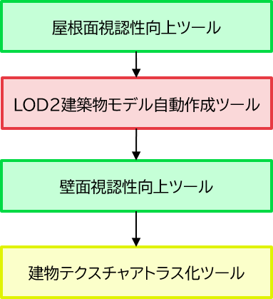
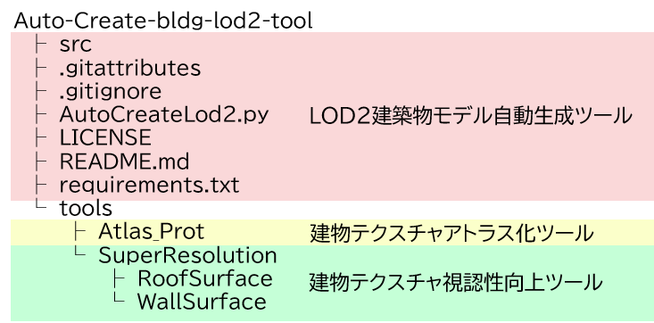

# LOD2建築物モデル自動作成ツール

## 1. 概要

LOD2建築物モデル自動作成ツール（以下、「本ツール」）は、国土交通省が進めるProject PLATEAUの一環として令和4年度に開発されました。\
本ツールは、DSM点群や建物外形データ等を入力データとしてLOD2建築物モデルの作成を自動的に行い、CityGML 形式で出力するシステムです。

## 2. 「LOD2建築物モデル自動作成ツール」について

令和4年度の「まちづくりのデジタルトランスフォーメーションの推進に向けた3D都
市モデルの標準仕様の拡張及びデータ整備の効率化等に関する調査業務」において、3D都市モデルLOD2を効率的に作成する手法を確立するためにAI等を活用したLOD2建築物の自動作成ツールを開発を行いました。本ツールはその開発の成果となります。 \
本ツールの詳細については[技術レポート](https://www.mlit.go.jp/plateau/file/libraries/doc/plateau_tech_doc_0056_ver01.pdf)を参照してください。

令和4年度に開発したLOD2建築物モデル自動作成ツールが出力するLOD2建築物モデルには、以下の課題が存在します。

- 建物テクスチャは、建物1棟に対して1つの画像ファイルを貼付する手法が主流となっていますが、1棟1画像ファイルとすると、画像ファイル数が多くなり、描画時の画像参照（読込）に時間を要する
- LOD2建築物に貼付されているテクスチャ画像は、一般的には航空写真をもとに作られており、地上解像度等の撮影条件の影響を受け、視認性が低いケースが存在する

この課題を解決するために令和5年度の「まちづくりのDXの推進に向けた3D都市モデルの標準仕様の拡張及びデータ整備の効率化等に関する調査業務」では、以下のツールを開発しました。

- 建物テクスチャアトラス化ツール \
  1棟1画像のテクスチャ画像を、複数棟1画像のテクスチャ画像へ統合します。

- 建物テクスチャ視認性向上ツール
  - 屋根面視認性向上ツール \
    LOD2建築物モデル自動作成ツールへの入力データである航空写真（中心投影）を入力とし、地上画素寸法6.25cm相当に超解像化された画像を出力します。
  - 壁面視認性向上ツール \
    LOD2建築物モデル自動作成ツールで出力されたテクスチャ画像を入力とし、壁面部のみ視認性を向上させた画像変換されたテクスチャ画像を出力します。

建物テクスチャアトラス化ツール及び建物テクスチャ視認性向上ツールに関しては、[3. 利用手順](#3-利用手順)に記載している利用チュートリアル内の操作マニュアル及び環境構築手順に詳細を記載してあります。

## 3. 利用手順

本ツールの構築手順及び利用手順については[利用チュートリアル](https://project-plateau.github.io/Auto-Create-bldg-lod2-tool/)を参照してください。

<ツールの利用順>

## 4. システム概要

### 【LOD2建築物モデル自動作成ツール】

#### ①CityGML入力機能

- LOD1建築物モデルのCityGML2.0形式のファイルを読み込みます。
  - LOD1建築物モデルは、[G空間情報センター 3D都市モデル（Project PLATEAU）ポータルサイト](https://www.geospatial.jp/ckan/dataset/plateau)で公開している建築物モデルのCityGMLデータを利用することを想定しています。

#### ②LOD2建築物モデル作成機能

- LOD1建築物モデルと航空写真DSM点群等を入力としてLOD2建築物モデルを作成します。
  - 航空写真DSM点群は、SfMソフトウェアを用いて航空写真（原画像）から作成することを想定しています。

#### ③位相一貫性チェック・補正機能

- 作成したLOD2建築物モデルのエラーチェックを行います。
- エラーが発生しているLOD2建築物モデルはログファイルにて通知します。

#### ④テクスチャ貼付け機能

- 航空写真(原画像)からLOD2建築物モデルのテクスチャ画像を作成しモデルに貼付けます.

#### ⑤CityGML出力機能

- LOD2建築物モデルをCityGML2.0形式のファイルとして出力します。
- 出力するデータは、入力CityGMLデータにLOD2建築物モデルデータが追記された形となります。

## 5. 利用技術

本ツールは、Python(バージョン3.9以上)のインストールが必要です。

| 種別 | ライブラリ名 | ライセンス | 説明 |
| - | - | - | - |
| ライブラリ |alphashape|MIT License|点群外形形状作成ライブラリ|
|  |anytree|Apache 2.0|木構造ライブラリ|
|  |autopep8|MIT License|コーディング規約(PEP)準拠にソースコードを自動修正するフォーマッターライブラリ|
|  |coverage|Apache 2.0|カバレッジ取得ライブラリ|
|  |einops|MIT License|数値計算ライブラリ|
|  |flake8|MIT License|静的解析ライブラリ|
|  |jakteristics|BSD License|点群の幾何学的特徴量計算ライブラリ|
|  |laspy|BSD 2-Clause License|LASファイル処理ライブラリ|
|  |lxml|BSD 3-Clause License|xml処理ライブラリ|
|  |matplotlib|Python Software Foundation License|グラフ描画ライブラリ|
|  |MLCollections|Apache 2.0|機械学習ライブラリ|
|  |MultiScaleDeformableAttention|Apache 2.0|物体検出ライブラリ|
|  |NumPy|BSD 3-Clause License|数値計算ライブラリ|
|  |Open3D|MIT License|点群処理ライブラリ|
|  |opencv-python|MIT License|画像処理ライブラリ|
|  |opencv-contrib-python|MIT License|画像処理ライブラリ|
|  |Pytorch|BSD 3-Clause License|機械学習ライブラリ|
|  |plateaupy|MIT License|CityGML読み込みライブラリ|
|  |PyMaxflow|GNU General Public License version 3.0|GraphCut処理ライブラリ|
|  |pyproj|MIT License|地理座標系変換ライブラリ|
|  |PuLP|BSD License|数理最適化ライブラリ|
|  |scikit-learn|BSD 3-Clause License|機械学習ライブラリ|
|  |scipy|BSD 3-Clause License|統計や線形代数、信号・画像処理などのライブラリ|
|  |Shapely|BSD 3-Clause License|図形処理ライブラリ|
|  |Torchvision|BSD 3-Clause Lisence|機械学習ライブラリ|

※ライブラリ名称は、pipコマンドでインストールで使用可能な名称を記載しています

- torch, torchvision以外のライブラリに関しては、pipコマンドによるインストールで利用可能なrequirements.txtをリポジトリに用意してあります
- torch, torchvisionのインストールに関しては、[LOD2建築物モデル自動作成ツールの環境構築手順書](https://project-plateau.github.io/Auto-Create-bldg-lod2-tool/manual/devManLod2Bldg.html)の「7章 GPU環境の構築」を参照してください

## 6. 動作環境

| 項目               | 最小動作環境               | 推奨動作環境                   |
| ------------------ | ------------------------- | ------------------------------ |
| OS                 | Microsoft Windows 10 または 11 | 同左 |
| CPU                | Intel Core i5以上 | Intel Core i7以上 |
| メモリ             | 8GB以上 | 16GB以上 |
| GPU                | NVIDIA Quadro P620以上 | NVIDIA RTX 2080以上 |
| GPU メモリ         | 2GB以上 | 8GB以上 |

## 7. 本リポジトリのフォルダ構成

| フォルダ名 |　詳細 |
|-|-|
| Auto-Create-bldg-lod2-tool(リポジトリ直下) | LOD2建築物自動作成ツール |
| tools/Atlas_Prot | 建物テクスチャアトラス化ツール |
| tools/SuperResolution | 建物テクスチャ視認性向上ツール |
| tools/SuperResolution/RoofSurface | 屋根面視認性向上ツール |
| tools/SuperResolution/WallSurface | 壁面視認性向上ツール |

## 8. ライセンス

- ソースコードおよび関連ドキュメントの著作権は国土交通省に帰属します。
- 本ツールはGNU General Public License v3.0を適用します。
- 本ツールは開発者の許可を得てHEAT: Holistic Edge Attention Transformer for Structured Reconstructionを利用させて頂いております。HEATは2023年1月29日より商用不可とライセンスを変更されましたが、本ソフトウェアはそれより前のバージョンを使用しております。
- 本ドキュメントは[Project PLATEAUのサイトポリシー](https://www.mlit.go.jp/plateau/site-policy/)（CCBY4.0および政府標準利用規約2.0）に従い提供されています。

## 9. 注意事項

- 本レポジトリは参考資料として提供しているものです。動作保証は行っておりません。
- 予告なく変更・削除する可能性があります。
- 本レポジトリの利用により生じた損失及び損害等について、国土交通省はいかなる責任も負わないものとします。

## 10. 参考資料

- 令和4年度 技術検証レポート: <https://www.mlit.go.jp/plateau/file/libraries/doc/plateau_tech_doc_0056_ver01.pdf>
- 令和5年度 技術検証レポート: <https://www.mlit.go.jp/plateau/file/libraries/doc/XXX>
