# LOD2建築物モデル自動生成ツール　チュートリアル

# 1.概要

## 1.1 本書の目的

本書は、LOD2建築物モデル自動生成ツール(以下、「本ツール」)のチュートリアルです。

 

# 2.動作環境

本ツールが必要とするハードウェアとソフトウェア環境はユーザマニュアルを参照してください。

 

# 3.チュートリアル用のデータセットのダウンロード

以下より、本チュートリアルで使用されているデータセットをダウンロードします。
 
<https://nikken-jp.box.com/s/n960r9l5kiju1ddl6ne9vlskkmatzt8a>

 

# 4.構成

## 4.1 ツール構成

本ツールのファイル構成を以下に示します。

 

\<ツールのファイル構成>  
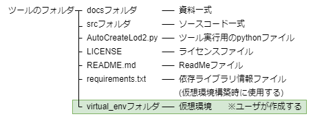

 

## 4.2 データセット構成

チュートリアルで使用するデータセット構成を以下に示します。
チュートリアルでは、データセットをFドライブ直下に保存している前提で説明を記載します。

 

\<チュートリアル用のデータセット構成>  
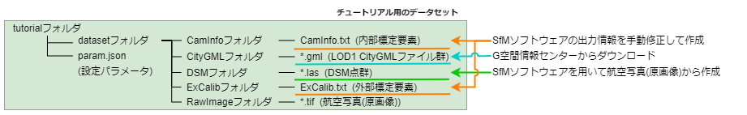

 

本来、以下のデータに関しては、SfMソフトウェアを用いて作成したり、G空間情報センターからデータをダウンロードしたりする必要がありますが、チュートリアル用のデータセットでは準備済みの状態です。

- DSM点群
- 内部標定要素
- 外部標定要素
- LOD1 CityGMLデータ

 

# 5.操作手順

## 5.1 概要

本ツールを使用してLOD2モデルの生成を行う際は、①仮想環境の構築、②入力データの作成、③設定パラメータファイルの作成、④ツールの実行、⑤出力結果の確認の順に作業を行います。\
なお、仮想環境の構築は初回のみの作業であり、仮想環境が構築済みであれば、入力データの作成から作業を開始してよいです。\
仮想環境の構築についてはユーザマニュアルの「2.3 仮想環境の作成」、「2.4 システム環境の構築」、「2.5 GPU環境の構築」を参照してください。\
入力データの作成からの各種作業の詳細については、次節以降に記載します。

 

\<操作手順>  
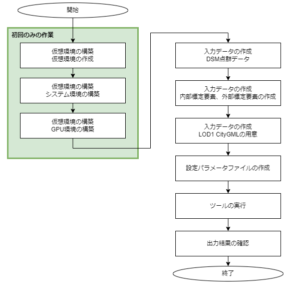

 

## 5.2 入力データの作成

### 5.2.1 入力データ一覧

ツール実行時に必要となる入力データの一覧を以下に示します。

\<入力データ一覧>
|
No.
|
データ名
|
データセットにおける対応データ
|
備考
|
| - | - | - | - |
|1|航空写真(原画像) |F:\tutorial\dataset\RawImage|・LOD2モデル化対象エリアの航空写真の原画像(TIFFファイル)   ・航空写真(原画像)の制約条件については、以下の通りです。   &nbsp;地上画素寸法: 25cm   &nbsp;オーバーラップ率: ≧60%   &nbsp;サイドラップ率: ≧30%|
|2|航空写真DSM点群|F:\tutorial\dataset\DSM|・SfMソフトウェアを使用して、航空写真(原画像)から作成します。   ・ファイルフォーマットはLASファイルとします。|
|3|外部標定要素|F:\tutorial\dataset\ExCalib\ExCalib.txt|・SfMソフトウェアが出力した外部標定要素データを本ツールのフォーマットに手動編集する必要があります。   ・ファイルフォーマットに関しては、後述の「[5.2.1.1 外部標定要素のファイルフォーマット](#5211-外部標定要素のファイルフォーマット)」を参照してください。|
|4|内部標定要素|F:\tutorial\dataset\CamInfo\CamInfo.txt|・SfMソフトウェアが出力した内部標定要素データを本ツールのフォーマットに手動編集する必要があります。   ・ファイルフォーマットに関しては、後述の「[5.2.1.2 内部標定要素のファイルフォーマット](#5212-内部標定要素のファイルフォーマット)」を参照してください。|
|5|LOD1 CityGMLデータ|F:\tutorial\dataset\CityGML|G空間情報センターからダウンロードすることを想定します。|

 

一部のデータは、SfMソフトウェアを用いて航空写真(原画像)から作成したり、手動編集によってデータを作成したりする必要があります。準備が必要な入力データについては「[5.2.2 DSM点群データの作成](#522-dsm点群データの作成)」以降に記載します。

 

#### 5.2.1.1 外部標定要素のファイルフォーマット

外部標定パラメータ情報の一覧を示します。

\<外部標定パラメータ情報の一覧>  
<table>
  <thead>
  <tr>
    <th>
No.
</th>
    <th>
要素名
</th>
    <th>
要素ID
</th>
    <th>
説明
</th>
  </tr>
  </thead>
  <tbody>
  <tr>
    <td>1</td>
    <td rowspan="3">投影中心位置</td>
    <td>X0</td>
    <td rowspan="3">航空写真撮影時のカメラの三次元座標</td>
  </tr>
  <tr>
    <td>2</td>
    <td>Y0</td>
  </tr>
  <tr>
    <td>3</td>
    <td>Z0</td>
  </tr>
    <tr>
    <td>4</td>
    <td rowspan="3">カメラ姿勢</td>
    <td>Omega</td>
    <td rowspan="3">航空写真撮影時のカメラの傾き   ω：進行方向の軸の回転角（ローリング）  φ：進行方向に直角で水平な軸の回転角（ピッチング）   κ：鉛直方向の軸の回転角（ヨーイング）</td>
  </tr>
  <tr>
    <td>5</td>
    <td>Phi</td>
  </tr>
  <tr>
    <td>6</td>
    <td>Kappa</td>
  </tr>
  </tbody>
</table>

 

外部標定パラメータファイルの記載例を以下に示します。

 

\<外部標定パラメータファイルの記載例>  
   
 
※ファイルを.csv形式として読込むため、列を一つのタブで区切る必要があります。

 

#### 5.2.1.2 内部標定要素のファイルフォーマット

内部標定パラメータ情報の一覧を示します。

 

\<内部標定パラメータ情報の一覧>  
<table>
  <thead>
  <tr>
    <th>
No.
</th>
    <th>
データ名称
</th>
    <th>
要素ID
</th>
    <th>
説明
</th>
  </tr>
  </thead>
  <tbody>
  <tr>
    <td>1</td>
    <td>焦点距離</td>
    <td>FocalLength</td>
    <td>カメラの焦点距離(mm)</td>
  </tr>
  <tr>
    <td>2</td>
    <td rowspan="2">イメージセンササイズ</td>
    <td>ImageSize_x</td>
    <td rowspan="2">イメージセンササイズ(x,y) の実サイズ(mm)</td>
  </tr>
  <tr>
    <td>3</td>
    <td>ImageSize_y</td>
  </tr>
    <tr>
    <td>4</td>
    <td rowspan="2">1pixelのサイズ</td>
    <td>PixelSize_x</td>
    <td rowspan="2">カメラの1pixel(x,y)の実サイズ(μm)</td>
  </tr>
  <tr>
    <td>5</td>
    <td>PixelSize_y</td>
  </tr>
  <tr>
    <td>6</td>
    <td rowspan="2">カメラ主点</td>
    <td>PrinciplePoint_x</td>
    <td rowspan="2">カメラ主点(x,y)の座標(mm)</td>
  </tr>
  <tr>
    <td>7</td>
    <td>PrinciplePoint_y</td>
  </tr>  
  </tbody>
</table>

 

\<内部標定パラメータファイルの記載例>  
 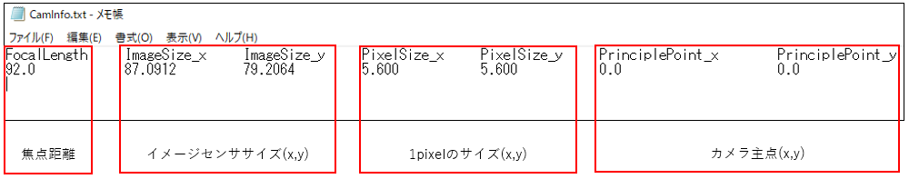  
 
※ファイルを.csv形式として読込むため、列を一つのタブで区切る必要があります。

 

### 5.2.2 DSM点群データの作成

SfMソフトウェアを用いて航空写真(原画像)から、DSM点群データを作成します。入力データとなる航空写真(原画像)には制約条件があるため注意してください。  
・地上画素寸法: 25cm  
・オーバーラップ率: ≧60%  
・サイドラップ率: ≧30%  

 

\<DSM点群データの作成>  
 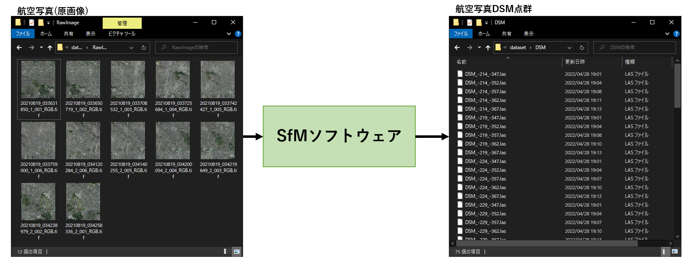  

 

### 5.2.3 内部標定要素、外部標定要素の作成

SfMソフトウェアが出力した内部標定要素、外部標定要素データを本ツールのフォーマットに沿う様に手動編集する必要があります。作成するファイルのフォーマットに関しては、前述の「[5.2.1.1 外部標定要素のファイルフォーマット](#5211-外部標定要素のファイルフォーマット)」「[5.2.1.2 内部標定要素のファイルフォーマット](#5212-内部標定要素のファイルフォーマット)」を参照してください。  

 

\<内部標定要素、外部標定要素の作成>  
 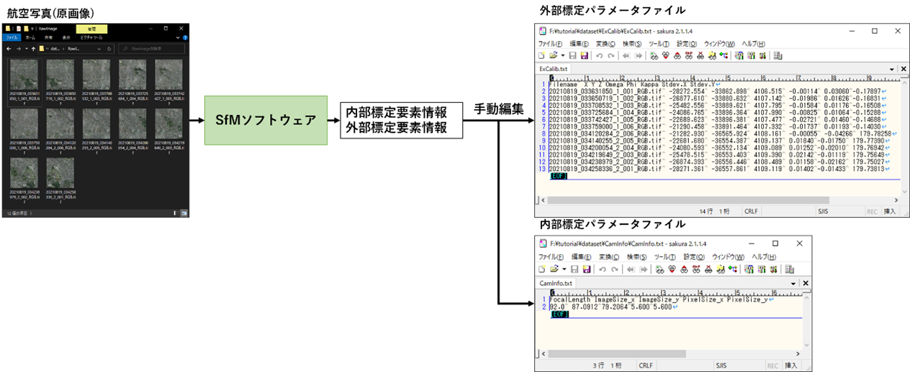  

 

### 5.2.4 LOD1 CityGMLファイルの用意

航空写真の撮影エリアに該当するLOD1 CityGMLファイルを用意する必要があります。本ツールでは、G空間情報センターからCityGMLファイルをダウンロードすることで入手することを想定しています。  

 

\<LOD1 CityGMLファイル>  
 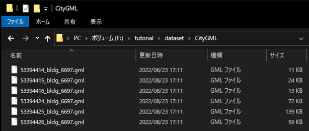  

 

## 5.3 設定パラメータファイルの作成

### 5.3.1 入力データ一覧

入力データの準備が完了した後は、設定パラメータファイルを作成します。なお、設定パラメータファイルの文字コードはUTF-8とします。  
設定パラメータファイルの設定値については以下に記載します。

 

\<設定パラメータ一覧>  
|
No.
|
キー名
|
設定値
|
備考
|
| - | - | - | - |
|1|LasCoordinateSystem|9|・データセットでは東京都三鷹市のデータを使用しているため、平面直角座標9系を指定します。(DSM点群データで使用している平面直角座標系の系番号を指定します。)|
|2|DsmFolderPath|F:\tutorial\dataset\DSM|・5.3.2 で作成したDSM点群データフォルダパスを指定します。|
|3|LasSwapXY|false|・DSM点群データのXY座標が、Xが北方向の座標値、Yが東方向の座標値の場合は設定値をtrueにします。|
|4|CityGMLFolderPath|F:\tutorial\dataset\CityGML|・5.3.4 で用意したLOD1 CityGMLフォルダパスを指定します。|
|5|TextureFolderPath|F:\tutorial\dataset\RawImage|・航空写真(原画像)フォルダパスを指定します。|
|6|ExternalCalibElementPath|F:\tutorial\dataset\ExCalib\ExCalib.txt|・5.3.3 で作成した外部標定パラメータファイルパスを指定します。|
|7|RotateMatrixMode|0|・テクスチャ貼付け処理のワールド座標からカメラ座標に変換する処理で使用する回転行列Rの種類を指定します。   ・0:R=R_x (ω) R_y (ϕ) R_z (κ)   ・1:R=R_z (κ)R_y (ϕ)R_x (ω)|
|8|CameraInfoPath|F:\tutorial\dataset\CamInfo\CamInfo.txt|・5.3.3 で作成した内部標定パラメータファイルパスを指定します。|
|9|OutputFolderPath|F:\tutorial\output|・LOD2 CityGMLファイルを出力するフォルダパスを指定します。|
|10|OutputOBJ|false|・LOD2 CityGMLデータとは別に、OBJフォーマットのLOD2モデル情報を出力する場合はtrueを、 出力しない場合はfalseを指定します。|
|11|OutputLogFolderPath|F:\tutorial\output|・ログファイルを出力するフォルダパスを指定します。|
|12|DebugLogOutput|false|・デバッグログを出力する場合はtrueを、出力しない場合はfalseを指定します。|
|13|PhaseConsistency|[位相一貫性検査/補正用 設定パラメータ一覧](#phase_param)を参照してください。||

 

\<位相一貫性検査/補正用 設定パラメータ一覧>  
|
No.
|
キー名
|
設定値
|
備考
|
| - | - | - | - |
|1|DeleteErrorObject|true|・位相一貫性検査エラー時に建物データを削除する場合はtrueを、削除しない場合はfalseを指定します。|
|2|NonPlaneThickness|0.05|・非平面検査で使用する閾値   ・非平面とみなす平面の厚み[m]を指定します。|
|3|NonPlaneAngle|15|・非平面検査で使用する閾値   ・非平面とみなす平面の法線角度[deg]を指定します。|

 

作成した設定パラメータファイルを以下に示します。  

 

\<設定パラメータファイル(F:\tutorial\param.json)>  
 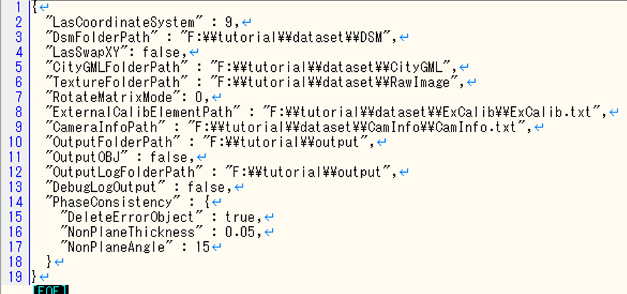  

 

## 5.4 ツールの実行

入力データの準備と設定ファイルの作成が完了した後は、ツールを実行してLOD2 CityGMLデータを作成します。  
作業環境を仮想環境に切り替え、以下のコマンドを実行します。

 

`> python AutoCreateLod2.py param.json`  

AutoCreateLod2.py : 本ツールのPythonコード  
param.json : 設定パラメータファイルパス  

 

本ツールの動作が終了した後は、仮想環境の終了動作(5.2.1（3）終了)を行うことで仮想環境から抜け出すことが出来ます。  
出力ファイルの確認を行う際は、以下フォルダの確認を行います。

 

 <table>
    <tr>
      <td>LOD2 CityGMLファイル</td>
      <td>設定パラメータファイルのOutputFolderPathで指定したフォルダ</td>
    </tr>
    <tr>
      <td>ログファイル</td>
      <td>設定パラメータファイルのOutputLogFolderPathで指定したフォルダ</td>
    </tr>
 </table>

 

チュートリアル環境で、ツールを実行する際のコマンド例を以下に示します。なお、チュートリアルのデータセットを使用してモデル化を行った場合は、20~30分の動作時間を要します。(入力するCityGMLデータによって動作時間は変動します。)  

 

\<ツール実行時のコマンド>  
 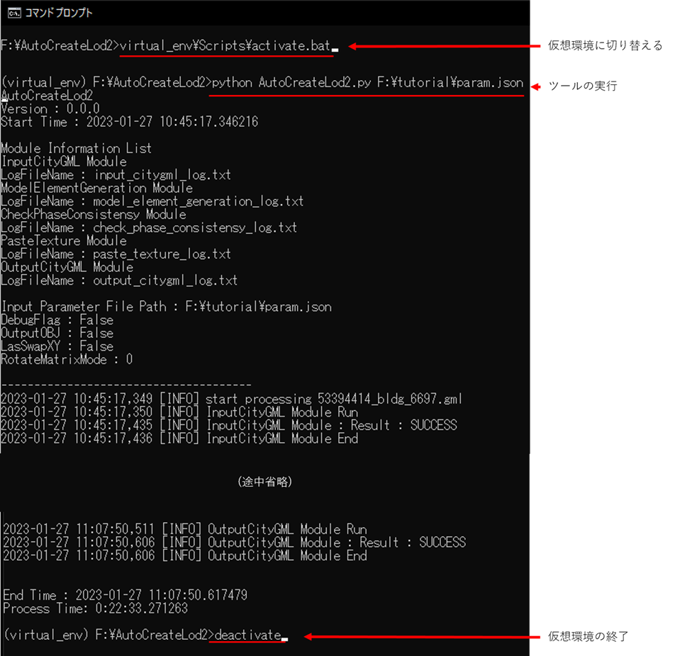  

 

## 5.5 出力結果の確認

### 5.5.1 出力データ一覧

以下に出力データの一覧を記載します。

 

\<出力データ一覧>
|
No.
|
データ名
|
チュートリアルにおける出力データ
|
備考
|
| - | - | - | - |
|1|LOD2 CityGMLデータ|F:\tutorial\ CityGML_YYYYMMDD_HHMMフォルダ内のCityGMLファイル|・入力CityGMLフォルダ内にあるCityGMLファイルごとに、LOD2 CityGMLファイルを出力します。|
|2|テクスチャ画像|F:\tutorial\output\CityGML_YYYYMMDD_HHMM\53394445_bldg_6697_appearanceフォルダ内の画像ファイル|・建物ごとにテクスチャ画像ファイルをJPGフォーマットで出力します。|
|3|テクスチャ付きLOD2建物形状データ(OBJファイル)|出力しない|・設定パラメータにて、OBJファイルを出力する設定(OutputOBJ = true)にした場合は以下にOBJファイルを出力します。   ・F:\tutorial\output\CityGML_YYYYMMDD_HHMM\obj|
|4|ログファイル|F:\tutorial\output\outputlog_ YYYYMMDD_HHMMSSフォルダ内のログファイル|・詳細は[出力ログファイル一覧](#log_list)を参照|

※YYYYMMDD_HHMM、YYYYMMDD_HHMMSSは作成日時

 

\<出力ログファイル一覧>
|
No.
|
データ名
|
チュートリアルにおける出力ログファイル
|
| - | - | - |
|1|実行ログファイル|F:\tutorial\output\outputlog_YYYYMMDD_HHMMSS\main_log.txt|
|2|CityGML入力モジュールログファイル|F:\tutorial\output\outputlog_YYYYMMDD_HHMMSS\input_citygml_log.txt|
|3|モデル要素生成モジュールログファイル|F:\tutorial\output\outputlog_YYYYMMDD_HHMMSS\model_element_generation_log.txt|
|4|位相一貫性検査/補正モジュールログファイル|F:\tutorial\output\outputlog_YYYYMMDD_HHMMSS\check_phase_consistensy_log.txt|
|5|テクスチャ貼付けモジュールログファイル|F:\tutorial\output\outputlog_YYYYMMDD_HHMMSS\paste_texture_log.txt|
|6|CityGML出力モジュールログファイル|F:\tutorial\output\outputlog_YYYYMMDD_HHMMSS\output_citygml_log.txt|
|7|モデル化結果サマリーファイル|F:\tutorial\output\outputlog_YYYYMMDD_HHMMSS\model_create_result.csv|

※YYYYMMDD_HHMM、YYYYMMDD_HHMMSSは作成日時

 

### 5.5.2 出力ファイルの確認

生成モデルの出力先と、ログファイルの出力先を「F:\tutorial\output」フォルダとした場合の出力結果を示します。

 

\<出力フォルダ(F:\tutorial\output)内の状態>  
 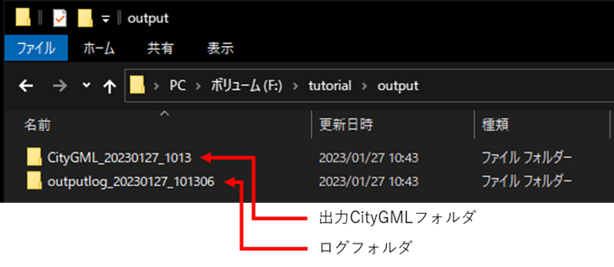  

 

\<出力CityGMLファイル一覧>  
 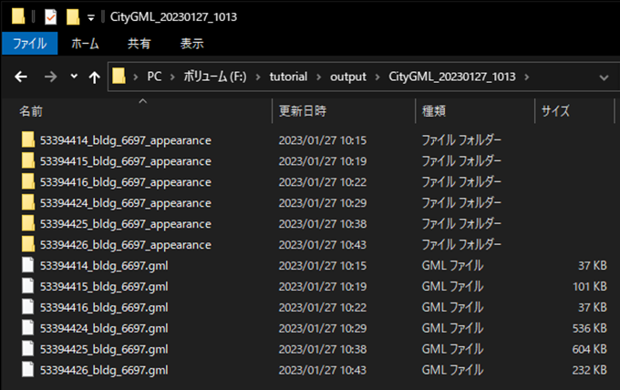  

 

\<出力テクスチャ画像例>  
 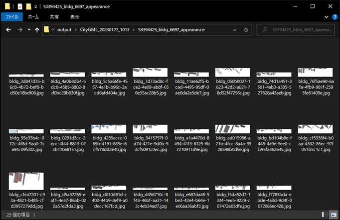  

 

\<出力ログファイル一覧>  
 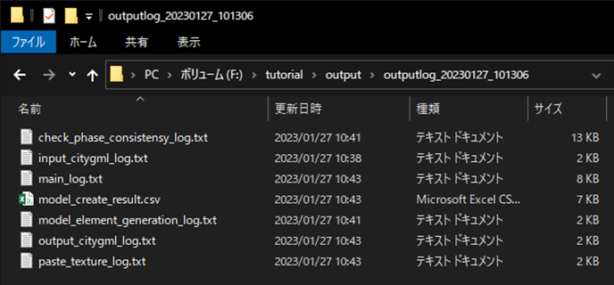  

 

\<LOD2モデル生成結果>  
 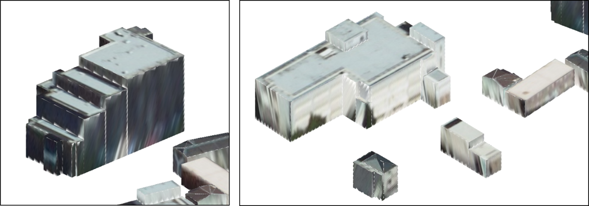  

 

\<モデル化結果サマリーファイル(モデル化結果部分を抜粋)>  
 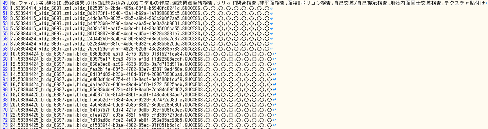  

各建物のモデル化結果は、モデル化結果サマリーファイル「model_create_result.csv」から確認可能です。モデル化が失敗している建物が存在する場合、各モジュールのログファイルからエラーの詳細内容を確認することが可能です。

 
<!-- ココまで -->

# 参考資料

- LOD2建築物自動生成ツールユーザマニュアル:  
<https://github.com/AAS-BasicSystemsDevelopmentDept/LOD2Creator/blob/main/docs/USER_MANUAL.md>
