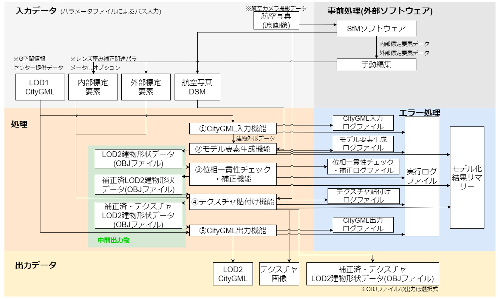
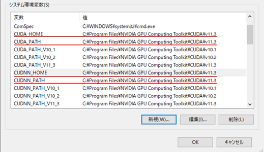
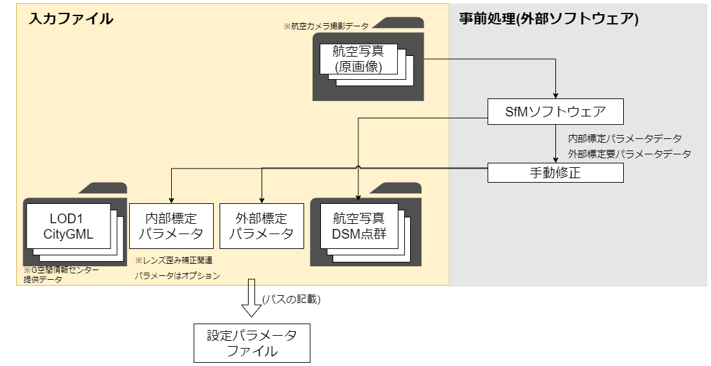
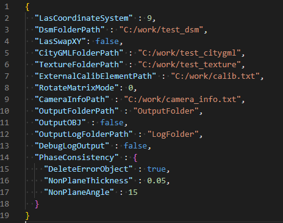
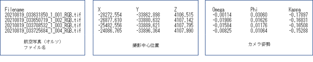
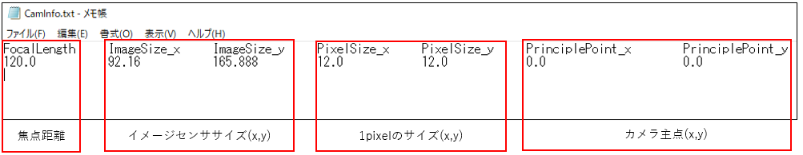
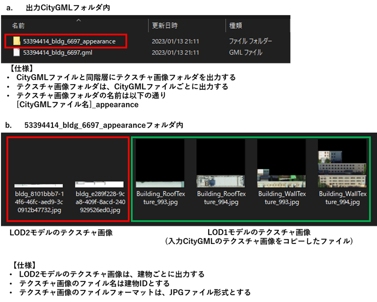
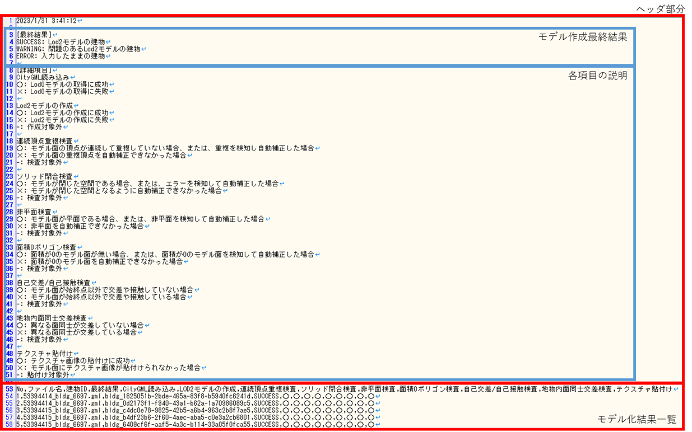
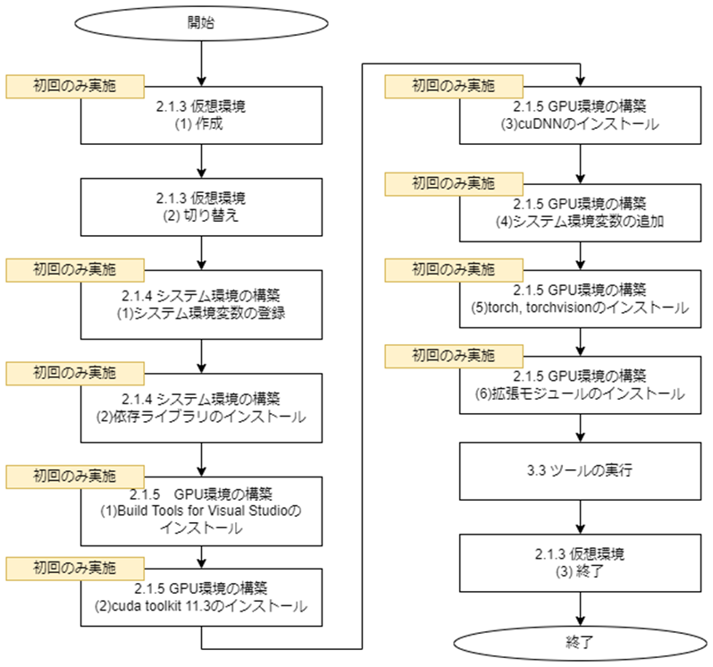

# LOD2建築物モデル自動生成ツール ユーザマニュアル

# 1.システム概要

LOD2建築物モデル自動生成ツール(以下、「本ツール」)はDSM点群や建物外形データ等を入力としてLOD2建物形状のモデル作成を行い、CityGML 形式にて建物形状データを出力する機能を持つツールです。  
本ツールは、①CityGML入力機能、②モデル要素生成機能、③位相一貫性チェック・補正機能、④テクスチャ貼付け機能、⑤CityGML出力機能の5つの機能から構成されます。各機能は独立していて、入力されたデータは順番に処理されます。  
ツール構成図を以下に示します。

 

<ツール構成図>  

 

# 2.動作環境

## 2.1 ハードウェア、OS環境

本ツールの推奨環境、および必要環境を以下に示します。

- 推奨環境

 <table>
    <tr>
      <td>OS</td>
      <td>Microsoft Windows 10 / 11</td>
    </tr>
    <tr>
      <td>CPU</td>
      <td>Intel Core i7以上</td>
    </tr>
        <tr>
      <td>Memory</td>
      <td>16GByte以上</td>
    </tr>
        <tr>
      <td>GPU</td>
      <td>NVIDIA RTX 2080以上</td>
    </tr>
        <tr>
      <td>GPU Memory</td>
      <td>8GByte以上</td>
    </tr>
 </table>

 

- 必要環境

 <table>
    <tr>
      <td>OS</td>
      <td>Microsoft Windows 10 / 11</td>
    </tr>
    <tr>
      <td>CPU</td>
      <td>Intel Core i5以上</td>
    </tr>
        <tr>
      <td>Memory</td>
      <td>8GByte以上</td>
    </tr>
        <tr>
      <td>GPU</td>
      <td>NVIDIA Quadro P620以上</td>
    </tr>
        <tr>
      <td>GPU Memory</td>
      <td>2GByte以上</td>
    </tr>
 </table>

  

## 2.2 ソフトウェア環境

本ツールは、Python(バージョン3.9以上)のインストールが必要です。  
以下のPythonライブラリを必要とします。

  

 <ライブラリ一覧>  
|
ライブラリ名
|
ライセンス
|
説明
|
| - | - | - |
|alphashape|MIT License|点群外形形状作成ライブラリ|
|anytree|Apache 2.0|木構造ライブラリ|
|autopep8|MIT License|コーディング規約(PEP)準拠にソースコードを自動修正しますフォーマッターライブラリ|
|coverage|Apache 2.0|カバレッジ取得ライブラリ|
|einops|MIT License|数値計算ライブラリ|
|flake8|MIT License|静的解析ライブラリ|
|jakteristics|BSD License|点群の幾何学的特徴量計算ライブラリ|
|laspy|BSD 2-Clause License|LASファイル処理ライブラリ|
|lxml|BSD 3-Clause License|xml処理ライブラリ|
|matplotlib|Python Software Foundation License|グラフ描画ライブラリ|
|MLCollections|Apache 2.0|機械学習ライブラリ|
|MultiScaleDeformableAttention|Apache 2.0|物体検出ライブラリ|
|NumPy|BSD 3-Clause License|数値計算ライブラリ|
|Open3D|MIT License|点群処理ライブラリ|
|opencv-python|MIT License|画像処理ライブラリ|
|opencv-contrib-python|MIT License|画像処理ライブラリ|
|Pytorch|BSD 3-Clause License|機械学習ライブラリ|
|plateaupy|MIT License|CityGML読み込みライブラリ|
|PyMaxflow|GNU General Public License version 3.0|GraphCut処理ライブラリ|
|pyproj|MIT License|地理座標系変換ライブラリ|
|PuLP|BSD License|数理最適化ライブラリ|
|scikit-learn|BSD 3-Clause License|機械学習ライブラリ|
|scipy|BSD 3-Clause License|統計や線形代数、信号・画像処理などのライブラリ|
|Shapely|BSD 3-Clause License|図形処理ライブラリ|
|Torchvision|BSD 3-Clause Lisence|機械学習ライブラリ|

 

## 2.3 仮想環境の作成

専用環境を作成しツールを実行する場合、仮想環境を構築することを推奨します。  
例として以下にvenvを使用した仮想環境の作成手順を示します。venv は Python の標準ツールであるため、インストールは不要です。なお、コマンドプロンプト上での操作とします。

 

（1） 作成  
以下のコマンドを使用し、仮想環境を作成します。一度実施すれば良いです。

`> cd [仮想環境を作成しますフォルダパス]`
 
`> py -[Pythonのインストールバージョン] -m venv [仮想環境名]`

[Pythonのインストールバージョン]：例として「3.9」など\
[仮想環境名]：任意の名称

 

（2） 切り替え  
以下のコマンドを使用し、作成した環境へ切り替えを行います。

`> cd [仮想環境を作成したフォルダパス]`
 
`> [仮想環境名]\Scripts\activate.bat`

[仮想環境名]：作成した仮想環境名

 

（3） 終了  
仮想環境を終了する場合には以下のコマンドを使用し、切り替えた環境を終了します。
このまま環境構築を実施する場合には終了する必要はありません。

`> deactivate`

 

## 2.4 システム環境の構築

本ツールを実行するための環境構築として、システム環境変数の登録と仮想環境へ依存ライブラリのインストールを行います。  
なお、依存ライブラリのインストールで使用するrequirements.txtはツールのフォルダ内に同梱しています。  

（1） システム環境変数の登録  
 <table>
    <tr>
      <td>変数名</td>
      <td>PYTHONPATH</td>
    </tr>
    <tr>
      <td>値</td>
      <td>F:\AutoCreateLod2\src  (本ツールのsrcフォルダまでのパス)</td>
    </tr>
 </table>

 

\<システム環境構築におけるシステム環境変数の登録>  
 

 

（2） 依存ライブラリのインストール  
以下コマンドを使用して、仮想環境に依存ライブラリをインストールします。  
requirements.txtは、本ツールのソースコードに同梱しています。

`> pip install –r requirements.txt`

 

## 2.5 GPU環境の構築

GPU環境の構築方法を以下に示します。なお、手順(1)～(4)はPCに対して一度設定すれば良いです。  
手順(5)以降に関しては、仮想環境ごとに設定する必要があります。

 

[GPU環境構築時の注意点]  
仮想環境に、torch、 torchvisionライブラリ、拡張モジュールをインストールする作業は、システム環境の構築後に行う必要があります。

 

（1） Build Tools for Visual Studioのインストール  
以下より、Build Tools for Visual Studio 2017、または、Build Tools for Visual Studio 2019をダウンロードし、インストールします。  
なお、Visual Studio 2017 、または、Visual Studio 2019のインストールでも良いです。  
<https://visualstudio.microsoft.com/ja/downloads/>

 

（2） cuda toolkit 11.3のインストール  
以下より、cuda toolkit 11.3 をダウンロードし、インストールします。  
なお、インストールオプションはデフォルト値のままで良いです。  
<https://developer.nvidia.com/cuda-11.3.0-download-archive?target_os=Windows&target_arch=x86_64&target_version=10&target_type=exe_local>

 

（3） cuDNNのインストール  
以下よりcuDNNをダウンロードします。  
<https://developer.nvidia.com/rdp/cudnn-download>

 

ダウンロードした「cudnn-windows-x86_64-8.6.0.163_cuda11-archive.zip」を解凍します。  
解凍したファイルを「C:\Program Files\NVIDIA GPU Computing Toolkit\CUDA\v11.3」以下の該当フォルダにコピーします。  

 

<cuDNNのインストール>  
   

 

（4） システム環境変数の追加  
システム環境変数に、以下の4変数を登録します。4変数の値は、共通とします。

 

 <table>
    <tr>
      <td>変数名</td>
      <td>CUDA_HOME, CUDA_PATH, CUDNN_HOME, CUDNN_PATH</td>
    </tr>
    <tr>
      <td>値</td>
      <td>C:\Program Files\NVIDIA GPU Computing Toolkit\CUDA\v11.3</td>
    </tr>
 </table>

 

<GPU環境構築におけるシステム環境変数の登録>  
 

 

（5） torch, torchvisionのインストール  
仮想環境に、torch, torchvisionをインストールします。  
`> pip install torch==1.12.1+cu113 torchvision==0.13.1+cu113 --extra-index-url https://download.pytorch.org/whl/cu113`  

 

<torch, torchvisionのインストール>  
   

 

（6） 拡張モジュールのインストール  
「src\createmodel\housemodeling\roof_edge_detection_model\thirdparty\heat\models\ops」フォルダをコピーし、任意のフォルダに貼り付けます。(opsフォルダのパスを短くすることが目的です。)  
仮想環境にて、拡張モジュールのビルドとインストールを行います。  
`> cd F:\ops`
 
`> python setup.py build`
 
`> python setup.py install`

 

\<拡張モジュールのインストール >  
 

 

インストール後、pip listコマンドにて「MultiScaleDeformableAttention」が一覧に表示されていれば、拡張モジュールのインストールが完了している状態です。

 

# 3.システム入力

入力ファイルのパスをあらかじめ設定パラメータファイルに記載し、これをツール実行時に読み込ませることで情報の入力を行います。  
以下に入力情報の概要図を記載します。

<入力ファイル概要図>  
 

 

## 3.1 入力ファイル一覧

以下に本ツールの入力ファイルを記載します。

 

<入力ファイル一覧>  
|
No
|
データ名
|
入力元
|
ファイルフォーマット
|
説明
|
| - | - | - | - | - |
|1|設定パラメータファイル|ツール実行時にコンソール指定|jsonファイル|・ツール実行時に使用するパラメータを記載するファイル（詳細は[3.2 設定パラメータファイル](#32-設定パラメータファイル)参照）|
|2|LOD1 CityGMLファイル|設定パラメータファイル “CityGMLFolderPath”キーに入力CityGMLフォルダパスを指定|CityGMLファイル|・建物外形データ ・建物IDを入力するためのファイル|
|3|航空写真(原画像)ファイル群|設定パラメータファイル “TextureFolderPath”キーにフォルダ名を指定|TIFFファイル|・入力LOD1 CityGMLファイル情報と関連のある航空写真(原画像)|
|4|航空写真DSM点群ファイル群|設定パラメータファイル “DsmFolderPath”キーにフォルダ名を指定|lasファイル(バージョンは、1.2～1.4に対応)|・航空写真(原画像)からSfM処理にて作成されたDSM点群データファイル群 ・建物の地面の高さを建物外形の外側近傍範囲にある点群データを使用して決定する関係上、航空写真DSM点群のデータ範囲は建物外形のデータ範囲より一回り大きな範囲のデータですことが望ましいです。|
|5|外部標定パラメータファイル|設定パラメータファイル “ExternalCalibElementPath”キーにファイル名を指定|txtファイル|・航空写真(原画像)からSfM処理にて作成された外部標定パラメータデータを変換したファイル ・対象となる航空写真枚数分の情報が記載されています。|
|6|内部標定パラメータファイル|設定パラメータファイル “CameraInfoPath”キーにファイル名を指定|txtファイル|・航空写真(原画像)からSfM処理にて作成された内部標定パラメータデータを変換したファイル ・航空写真撮影に使用した航空カメラに関する情報が記載されています。|

 

## 3.2 設定パラメータファイル

本ツール実行時に使用するパラメータを記載するファイルです。

 

<設定パラメータファイルの仕様>

 <table>
    <tr>
      <td>ファイル形式</td>
      <td>JSON</td>
    </tr>
    <tr>
      <td>ファイル名</td>
      <td>param.json</td>
    </tr>
        <tr>
      <td>格納フォルダ</td>
      <td>任意</td>
    </tr>
        <tr>
      <td>入力先</td>
      <td>システム全般</td>
    </tr>  
        <tr>
      <td>特記事項</td>
      <td>文字コードはUTF-8とします。</td>
    </tr>
 </table>

 

設定パラメータファイルのパラメータ一覧を以下に記載します。

 

<設定パラメータ一覧>  
|
No
|
キー名
|
値形式
|
説明
|
| - | - | - | - |
|1|LasCoordinateSystem|数値|航空写真DSM点群の平面直角座標系の番号です。 1～19の数値にて指定します。 未記入および1～19以外の値が入力された場合は無効とし、エラーメッセージを表示し、処理を中止します。|
|2|DsmFolderPath|文字列|航空写真DSM点群のフォルダパスを指定します。 指定されたフォルダパスが存在しない場合は無効とし、エラーメッセージを表示し、処理を中止します。|
|3|LasSwapXY|真偽値|LASファイルのXY座標を入れ替えて使用するか否かを切り替えるフラグです。設定値がtrueの場合は、LASファイルのXY座標を入れ替えます。 システム内部座標系が、xが東方向、yが北方向の値のため、LASファイル座標系が同一座標系となるようにユーザーがフラグを切り替える必要があります。 未記入、または、真偽値以外の値が入力された場合は、エラーメッセージを表示し、処理を中止します。|
|4|CityGMLFolderPath|文字列|入力CityGMLフォルダパスを指定します。 未記入および指定されたフォルダが存在しない場合、フォルダ内にCityGMLファイルがない場合は無効とし、エラーメッセージを表示し、処理を中止します。|
|5|TextureFolderPath|文字列|航空写真（原画像）の格納フォルダパスです。 未記入および指定されたファイルが存在しない場合は無効とし、警告メッセージを表示し、テクスチャ貼付け処理を実施しません。|
|6|ExternalCalibElementPath|文字列|外部標定パラメータのファイルパスです。 未記入および指定されたファイルが存在しない場合は無効とし、警告メッセージを表示し、テクスチャ貼付け処理を実施しません。|
|7|RotateMatrixMode|整数値|テクスチャ貼付け処理において、ワールド座標からカメラ座標に変換する際に使用する回転行列Rの種類を切り替える設定値です。 モードの種類は以下2種類とします。 0:R=R_x (ω) R_y (ϕ) R_z (κ) 1:R=R_z (κ)R_y (ϕ)R_x (ω) 未記入、または、0,1以外の値が入力された場合は、エラーメッセージを表示し、処理を中止します。|
|8|CameraInfoPath|文字列|内部標定パラメータのファイルパスです。 未記入および指定されたファイルが存在しない場合は無効とし、警告メッセージを表示し、テクスチャ貼付け処理を実施しません。|
|9|OutputFolderPath|文字列|生成モデルの出力先フォルダパスです。 指定されたフォルダ内に出力フォルダを作成し、作成したフォルダ内にCityGMLファイルとテクスチャ情報を出力します。 テクスチャ情報は、入力CityGMLファイル名称(拡張子は除く)_appearanceフォルダに格納されます。|
|10|OutputOBJ|真偽値|生成モデルをCityGMLファイルとは別にOBJファイルとして出力するか否かを設定するフラグです。 trueまたはfalseで値を指定します。 未記入または、真偽値以外の値が入力された場合はエラーメッセージを表示し、処理を中止します。|
|11|OutputLogFolderPath|文字列|ログのフォルダパスです。 未記入または、存在しない場合は、本システムのPythonコードと同階層のログフォルダ“output_log”にログファイルを作成し、処理を中止します。|
|12|DebugLogOutput|真偽値|デバッグレベルのログを出力するかどうかのフラグです。 trueまたはfalseで値を指定します。 未記入または、真偽値以外の値が入力された場合は、エラーメッセージを表示し、処理を中止します。|
|13|PhaseConsistency|辞書|位相一貫性検査/補正処理用パラメータです。 項目は[位相一貫性検査/補正用設定パラメータ一覧](#param_list)を参照してください。|

 

<位相一貫性検査/補正用設定パラメータ一覧>  
|
No
|
キー名
|
値形式
|
説明
|
| - | - | - | - |
|1|DeleteErrorObject|真偽値|位相一貫性検査エラー時に建物データを削除するかどうかのフラグです。 trueまたはfalseで値を指定します。 未記入または、真偽値以外の値が指定された場合は、エラーメッセージを表示し、処理を中止します。|
|2|NonPlaneThickness|数値|位相一貫性非平面厚み検査のエラー判定閾値です。 非平面とみなす平面の厚みを m(メートル) で指定します。 未記入または、負の値が指定された場合は、エラーメッセージを表示し、処理を中止します。 |
|3|NonPlaneAngle|数値|位相一貫性非平面法線角度検査のエラー判定閾値です。 非平面とみなす平面の法線角度を°で指定します。 未記入または、0°未満や90°以上が指定された場合は、エラーメッセージを表示し、処理を中止します。|

 

設定パラメータファイルの記載例を以下に示します。

 

<設定パラメータファイル記載例>  
 

  

## 3.3 外部標定パラメータファイル

外部標定パラメータ情報の一覧を示します。

  

 <外部標定パラメータ情報の一覧>  
<table>
  <thead>
  <tr>
    <th>
No.
</th>
    <th>
要素名
</th>
    <th>
要素ID
</th>
    <th>
説明
</th>
  </tr>
  </thead>
  <tbody>
  <tr>
    <td>1</td>
    <td rowspan="3">投影中心位置</td>
    <td>X0</td>
    <td rowspan="3">航空写真撮影時のカメラの三次元座標</td>
  </tr>
  <tr>
    <td>2</td>
    <td>Y0</td>
  </tr>
  <tr>
    <td>3</td>
    <td>Z0</td>
  </tr>
    <tr>
    <td>4</td>
    <td rowspan="3">カメラ姿勢</td>
    <td>Omega</td>
    <td rowspan="3">航空写真撮影時のカメラの傾き   ω：進行方向の軸の回転角（ローリング）  φ：進行方向に直角で水平な軸の回転角（ピッチング）   κ：鉛直方向の軸の回転角（ヨーイング）</td>
  </tr>
  <tr>
    <td>5</td>
    <td>Phi</td>
  </tr>
  <tr>
    <td>6</td>
    <td>Kappa</td>
  </tr>
  </tbody>
</table>

 

外部標定パラメータファイルの記載例を以下に示します。

 

\<外部標定パラメータファイルの記載例>  
 
 
※ファイルを.csv形式として読込むため、列を一つのタブで区切る必要があります。

 

## 3.4　 内部標定パラメータファイル

内部標定パラメータ情報の一覧を示します。

 

\<内部標定パラメータ情報の一覧>  
<table>
  <thead>
  <tr>
    <th>
No.
</th>
    <th>
データ名称
</th>
    <th>
要素ID
</th>
    <th>
説明
</th>
  </tr>
  </thead>
  <tbody>
  <tr>
    <td>1</td>
    <td>焦点距離</td>
    <td>FocalLength</td>
    <td>カメラの焦点距離(mm)</td>
  </tr>
  <tr>
    <td>2</td>
    <td rowspan="2">イメージセンササイズ</td>
    <td>ImageSize_x</td>
    <td rowspan="2">イメージセンササイズ(x,y) の実サイズ(mm)</td>
  </tr>
  <tr>
    <td>3</td>
    <td>ImageSize_y</td>
  </tr>
  <tr>
    <td>4</td>
    <td rowspan="2">1pixelのサイズ</td>
    <td>PixelSize_x</td>
    <td rowspan="2">カメラの1pixel(x,y)の実サイズ(μm)</td>
  </tr>
  <tr>
    <td>5</td>
    <td>PixelSize_y</td>
  </tr>
  <tr>
    <td>6</td>
    <td rowspan="2">カメラ主点</td>
    <td>PrinciplePoint_x</td>
    <td rowspan="2">カメラ主点(x,y)の座標(mm)</td>
  </tr>
  <tr>
    <td>7</td>
    <td>PrinciplePoint_y</td>
  </tr>  
  </tbody>
</table>

 

<内部標定パラメータファイルの記載例>  
   
 
※ファイルを.csv形式として読込むため、列を一つのタブで区切る必要があります。

 

# 4.システム出力

以下に出力情報の概要図を記載します。

 

<出力ファイル概要図>  
 

  

## 4.1 出力ファイル一覧

以下に本ツールの出力ファイルを記載します。

 

<出力ファイル一覧>  
|
No
|
データ名
|
出力先
|
ファイルフォーマット
|
説明
|
| - | - | - | - | - |
|1|LOD2 CityGMLファイル|設定パラメータファイル “OutputFolderPath”キーで指定したフォルダ|CityGMLファイル|・入力されたCityGMLデータにLOD2建物形状データを追記したデータ|
|2|テクスチャ画像|LOD2 CityGMLファイルと同階層の[(LOD2 CityGMLファイルの拡張子を除いた名称)_appearance]フォルダ|JPGファイル|・LOD2建物形状データ作成時にテクスチャ画像が生成された場合のみ出力されます。 ・建物1棟につき1ファイルが出力されます。|
|3|ログファイル|設定パラメータファイル “OutputLogFolderPath”キーで指定したフォルダパスに新規作成した\[outputlog_YYYMMDD_HHMMSS](YYYMMDD_HHMMSSは作成時の時間) フォルダ （未記入または、存在しない場合は、実行時のカレントフォルダにログフォルダ“output_log”を作成し、その中に\[outputlog_YYYMMDD_HHMMSS](YYYMMDD_HHMMSSは作成時の時間) フォルダを作成します）|txtファイル/csvファイル|・[4.4 ログファイル](#44-ログファイル)を参照してください。|
|4|OBJファイル|LOD2 CityGMLファイルと同階層のobjフォルダ|OBJファイル/マテリアルファイル|・設定パラメータのOutputOBJがtrueの場合に、テクスチャ貼付け済みのモデルをOBJファイルに出力します。 ・OBJファイルは建物ごとに出力し、テクスチャ情報が記載されているマテリアルファイルは入力CityGMLファイルごとに出力します。 ・マテリアルファイルが参照するテクスチャ画像は、CityGMLファイルが参照するテクスチャ画像と同一です。|

 

## 4.2 LOD2 CityGMLファイル

本ツールが出力するLOD2 CityGMLファイルは、入力CityGMLファイルの建物情報にLOD2モデル情報(建物形状情報とテクスチャ情報)を追記したCityGMLファイルです。  
以下に、出力LOD2 CityGMLファイルの例を示します。  

 

<出力LOD2 CityGMLファイル例>  
 

 

## 4.3 LOD2 CityGMLファイル

LOD2建物形状データ作成時にテクスチャ画像が生成された場合は、LOD2 CityGMLファイルと同階層にテクスチャ画像フォルダを出力します。出力フォルダ内には、LOD2モデルのテクスチャ画像を建物ごとに出力します。また、入力CityGMLファイルにテクスチャ画像が付属している場合は、出力フォルダに入力CityGMLファイルのテクスチャ画像をコピーします。

 

<出力テクスチャ画像例>  
 

  

## 4.4 ログファイル

（1） 出力ログファイル一覧  
以下に出力ログファイル一覧を記載します。  
[No.1実行ログファイル]の詳細情報として、[No.2～6]の各モジュールログファイルを出力します。  
なお[No.1～6]は開発者向けログ、[No.7モデル化結果サマリーファイル]はユーザー向けログを想定しています。  

  

<出力ログファイル一覧>  
|
No
|
データ名
|
出力ファイル名
|
説明
|
| - | - | - | - |
|1|実行ログファイル|main_log.txt|・本システムのログメッセージを出力します。|
|2|CityGML入力モジュールログファイル|input_citygml_log.txt|・CityGML入力モジュールのログメッセージを出力します。|
|3|モデル要素生成モジュールログファイル|model_element_generation_log.txt|・モデル要素生成モジュールのログメッセージを出力します。|
|4|位相一貫性検査/補正モジュールログファイル|check_phase_consistensy_log.txt|・位相一貫性検査/補正モジュールのログメッセージを出力します。|
|5|テクスチャ貼付けモジュールログファイル|paste_texture_log.txt|・テクスチャ貼付けモジュールのログメッセージを出力します。|
|6|CityGML出力モジュールログファイル|output_citygml_log.txt|・CityGML出力モジュールのログメッセージを出力します。|
|7|モデル化結果サマリーファイル|model_create_result.csv|・各建物のモデル化結果ログを出力します。|

  

（2） 実行ログファイル  
1） ログ構成  
以下に実行ログファイルの構成を記載します。  

  

<ログ構成>  

   

<ログ構成>  
<table>
  <thead>
  <tr>
    <th>
出力場所
</th>
    <th></th>
    <th>
項目名
</th>
  </tr>
  </thead>
  <tbody>
  <tr>
    <td rowspan="9">ヘッダ情報</td>
    <td>①</td>
    <td>本ツール名</td>
  </tr>
  <tr>
    <td>②</td>
    <td>本ツールのバージョン</td>
  </tr>
  <tr>
    <td>③</td>
    <td>本ツールの起動時間</td>
  </tr>
  <tr>
    <td>④</td>
    <td>各モジュールの名前とモジュールログファイル名</td>
  </tr>
  <tr>
    <td>⑤</td>
    <td>設定パラメータファイルパス</td>
  </tr>
  <tr>
    <td>⑥</td>
    <td>モジュール動作中のデバッグログ出力フラグ</td>
  </tr>
  <tr>
    <td>⑦</td>
    <td>テクスチャ貼付け済みOBJファイル出力フラグ</td>
  </tr>
  <tr>
    <td>⑧</td>
    <td>入力LASファイルのXY座標を入れ替えて使用するか否かのフラグ</td>
  </tr>
  <tr>
    <td>⑨</td>
    <td>テクスチャ貼付け処理で使用します回転行列のモード</td>
  </tr>
  <tr>
    <td>モジュールごとの実行結果ログ</td>
    <td>⑩</td>
    <td>各モジュールのログ</td>
  </tr>
  <tr>
    <td rowspan="2">フッタ情報</td>
    <td>⑪</td>
    <td>本ツールの終了時間</td>
  </tr>
  <tr>
    <td>⑫</td>
    <td>本ツールの稼働時間</td>
  </tr>
  </tbody>
</table>

 

[⑩各モジュールのログ]の例を以下に記載します。  
処理対象のCityGMLファイルごとに、各モジュールの結果概要(モジュール開始・終了日時、モジュール実施結果)が記載されます。  
処理対象のCityGMLファイルが切り替わる際は、区切り線と処理対象ファイル名が記載されます。  

 

<各モジュールログ例>  

 

ログファイルに出力されるログレベルの一覧を以下に記載します。

 

<ログレベル>  
|
ログレベル
|
説明
|
| - | - |
|ERROR|処理が途中終了するような致命的なエラー|
|MODEL_ERROR|LOD2建物モデルに関するエラー(生成エラー、検査結果がエラーの場合等)|
|WARN|問題ですが、処理を継続実行可能なエラー|
|INFO|モジュールの開始や終了などの情報|
|DEBUG|システムの動作状況に関する詳細な情報 パラメータファイルにてDebugLogOutputがtrueに指定されている場合は、出力します。|

 

2） ログメッセージ  
以下に実行ログファイルの主なログメッセージを記載します。  
開発者向けログである性質上、記載以外のメッセージが出力される場合があります。  

 

<ログメッセージ>  
|
No
|
ログレベル
|
エラー文言
|
説明
|
| - | - | - | - |
|1|[ERROR]|parameter file does not exist.|設定ファイルが存在しない。|
|2|[ERROR]|[KeyName] key does not exist in json file.|設定ファイルに[KeyName]のパラメータの記載が不足している。|
|3|[ERROR]|LasCoordinateSystem is invalid. (input value range : 1 - 19)|航空写真DSM点群の平面直角座標系の番号に1～19以外の値が入力された。|
|4|[ERROR]|CityGMLFolderPath is invalid.|LOD1 CityGMLフォルダパスが文字列ではない。|
|5|[ERROR]|CityGMLFolderPath not found.|LOD1 CityGMLフォルダパスが存在しない。|
|6|[ERROR]|TextureFolderPath is invalid.|航空写真(原画像) のフォルダパスが文字列ではない。|
|7|[ERROR]|DsmFolderPath is invalid.|航空写真DSM点群のフォルダパスが文字列ではない。|
|8|[ERROR]|LAS file (*.las) not found.|航空写真DSM点群のフォルダ内にLASファイルがない、もしくはフォルダパスが存在しない。|
|9|[ERROR]|DSM folder not found.|航空写真DSM点群のフォルダパスが存在しない。|
|10|[ERROR]|ExternalCalibElementPath is invalid.|外部標定パラメータファイルパスが文字列ではない。|
|11|[ERROR]|CameraInfoPath is invalid.|内部標定パラメータファイルパスが文字列ではない。|
|12|[ERROR]|OutputFolderPath is invalid.|生成モデルの出力先フォルダパスが文字列ではない。|
|13|[ERROR]|[OutputFolderPath] cannot make.|生成モデルの出力先パスが作成不可能なディレクトリを指定している。 [OutputFolderPath]には、実際のフォルダパスが記載される。|
|14|[ERROR]|json file decoding error: Expecting value line [X] column [Y].|設定パラメータファイルに未記入項目がある。以下は該当箇所の数値が表示される。 ［X］：未記入の行 ［Y］：未記入の列(文字数）|
|15|[ERROR]|ModelElementGeneration Module Not Output Obj File|モデル要素生成モジュールから中間出力OBJファイルが出力されていない。|
|16|[ERROR]|CheckPhaseConsistensy Module Not Output Obj File|位相一貫性チェック・補正モジュールから中間出力OBJファイルが出力されていない。|
|17|[ERROR]|OutputLogFolderPath is invalid.|ログのフォルダパスが未設定、または、文字列ではない。|
|18|[ERROR]|DebugLogOutput is invalid.|デバッグレベルのログを出力するか否かを切り替えるフラグに真偽値以外の値を入力している。|
|19|[ERROR]|LasSwapXY is invalid.|LASファイルのXY座標を入れ替えて使用するか否かを切り替えるフラグに真偽値以外の値を入力している。|
|20|[ERROR]|OutputOBJ is invalid.|生成モデルをCityGMLファイルとは別にOBJファイルとして出力するか否かを設定しますフラグに真偽値以外の値を入力している。|
|21|[ERROR]|RotateMatrixMode is invalid.|テクスチャ貼付け処理に使用する回転行列Rのモードに0,1以外の値を入力している。|
|22|[ERROR]|DeleteErrorObject is invalid.|位相一貫性検査エラー時に建物データを削除するか否かを切り替えるフラグに真偽値以外の値を入力している。|
|23|[ERROR]|NonPlaneThickness is invalid.|位相一貫性非平面厚み検査のエラー判定閾値が未記入または、負の値を入力している。|
|24|[ERROR]|NonPlaneAngle is invalid.|位相一貫性非平面法線角度検査のエラー判定閾値に0°未満または、90°以上の値を入力している。|
|25|[WARNING]|OutputLogFolderPath Value change "" to "output_log"|ログのフォルダパスが未設定のため、実行時のカレントフォルダにログフォルダ“output_log”を作成しログファイルを出力します。|

 

（3） モジュールログファイル  
1） ログ構成  
モジュールログファイルの例を以下に記載します。  
各モジュールの詳細結果(モジュール開始・終了日時、モジュールの任意メッセージ)が記載されます。処理対象のCityGMLファイルが切り替わる際は、区切り線と処理対象ファイル名が記載されます。  
なおメッセージのログレベルは[ログレベル](#log_level)の表を参照とします。  

 

<モジュールログ例(CityGML出力)>  

 

2） ログメッセージ  
以下に各モジュールのエラーログファイルの主なログメッセージを記載します。  
開発者向けログである性質上、記載以外のメッセージが出力される場合があります。  

 

<CityGML入力モジュール　ログメッセージ>  
|
No
|
ログレベル
|
エラー文言
|
説明
|
| - | - | - | - |
|1|[MODEL_ERROR]|All outline not found|入力したCityGMLファイルから一つも建物外形データが見つからない。|
|2|[WARNING]|Outline not found [建物ID]|入力したCityGMLファイルから記載の建物IDの建物外形データが見つからない。|

 

<モデル要素生成モジュール　ログメッセージ>  
|
No
|
ログレベル
|
エラー文言
|
説明
|
| - | - | - | - |
|1|[ERROR]|ModelCreator.create, No LoD0 polygon data.|建物外形データが空である。|
|2|[ERROR]|ModelCreator.__init__, DSM folder not found.|航空写真DSM点群のフォルダパスが存在しない。|
|3|[ERROR]|ModelCreator.__init__, LAS file (*.las) not found.|航空写真DSM点群のLASファイルが存在しない。|
|4|[MODEL_ERROR]|[建物ID], LasManager.read_header, No Las file within the read range.|建物外形データ範囲内に重畳するLASファイルが存在しない。|
|5|[MODEL_ERROR]|[建物ID],LasManager.get_points, No point cloud data within the read range.|建物外形データ範囲内に点群データが存在しない。|
|6|[MODEL_ERROR]|[建物ID] ,LasManager.get_points, No ground point cloud data.|地面点群データが存在しない。|
|7|[MODEL_ERROR]|[建物ID], Building.__init__, LoD0 polygon has less than 4 vertices.|頂点列が4点未満のデータを含む建物外形データである。 建物外形データは、最低3頂点からなる三角形ポリゴンとする。なお、ポリゴンの頂点列データの終点には、始点と同一データを挿入するものとする。そのため、建物外形データは4頂点以上の頂点列データを持つ。|
|8|[MODEL_ERROR]|Zero area face is detected.|面積が0の建物外形データである。|
|9|[WARNING]|Could not create models for some data.|作成できないモデルが存在する。|
|10|[WARNING]|LasManager.read_header, Failed to read Las file. ([LASファイル名])|航空写真DSM点群の取得時に例外が発生するLASデータがある。|

 

<位相一貫性チェック・補正モジュール　ログメッセージ>  
|
No
|
ログレベル
|
エラー文言
|
説明
|
| - | - | - | - |
|1|[MODEL_ERROR]|'File : [中間出力OBJファイルパス]',  'Error : Self intersecting polygon is detected.',  'Vertices : [座標配列]',  'Status : Deleted.'|自己交差エラーもしくは、自己接触エラーを検知した。(該当するファイルを削除する)|
|2|[MODEL_ERROR]|'File : [中間出力OBJファイルパス]',  'Error : Self intersecting polygon is detected.',  'Vertices : [座標配列]',  'Status : Error.'|自己交差エラーもしくは、自己接触エラーを検知した。(該当するファイルを削除しない)|
|3|[MODEL_ERROR]|'File : [中間出力OBJファイルパス]',  'Error : Self intersecting faces are detected.',  'Vertices : [座標配列]',  'Status : Deleted.'|地物内面同士交差エラーを検知した。(該当するファイルを削除する)|
|4|[MODEL_ERROR]|'File : [中間出力OBJファイルパス]',  'Error : Self intersecting faces are detected.',  'Vertices : [座標配列]',  'Status : Error.'|地物内面同士交差エラーを検知した。(該当するファイルを削除しない)|
|5|[MODEL_ERROR]|'File  : [中間出力OBJファイルパス] ',  'Error : Zero area face is detected.', 'Vertices : [座標配列]',  'Status : Auto corrected. '|面積0ポリゴンエラーを検知して、自動補正した。|
|6|[MODEL_ERROR]|'File : [中間出力OBJファイルパス]',  'Error : Model is not a solid model.',  'Vertices : [座標配列]',  'Status : Auto corrected.'|ソリッド閉合エラーを検知して、自動補正した。|
|7|[MODEL_ERROR]|'File : [中間出力OBJファイルパス]',  'Error : Double Points is detected.',  'Vertices : [座標配列]',  'Status : Auto corrected.'|連続頂点重複エラーを検知して、自動補正した。|
|8|[MODEL_ERROR]|'File : [中間出力OBJファイルパス]',  'Error : Non-Plane face is detected',  'Vertices : [座標配列]',  'Status : Auto corrected.'|非平面(法線角度もしくは厚み)エラーを検知して、自動補正した。|

 

<テクスチャ貼付けモジュール　ログメッセージ>  
|
No
|
ログレベル
|
エラー文言
|
説明
|
| - | - | - | - |
|1|[MODEL_ERROR]|Folder not found (Texturefolder)|航空写真フォルダパスが存在しない。|
|2|[MODEL_ERROR]|Photo not found|全ての航空写真の読み込みに失敗した。|
|3|[MODEL_ERROR]|No such file or directory: [外部標定パラメータファイルパスor内部標定パラメータファイルパス]|外部標定パラメータファイルパス、もしくは内部標定パラメータファイルパスが存在しない。|
|4|[MODEL_ERROR]|caminfo data is insufficient|内部標定パラメータ情報に不足がある。|
|5|[WARNING]|PhotoFile Not Found [航空写真ファイルパス]|航空写真ファイルが存在しない。|
|6|[WARNING]|excalib data is insufficient|外部標定パラメータ情報に不足がある。|
|7|[WARNING]|excalib data including empty|外部標定パラメータ情報に値が入っていない。|
|8|[WARNING]|Texture not found id:[建物ID]|テクスチャ画像が見つからず貼付けできなかった。|
|9|[DEBUG]|roof refImage:[航空写真ファイル名]|屋根面テクスチャ画像抽出元の航空写真ファイル名。|
|10|[DEBUG]|wall refImage:[航空写真ファイル名]|壁面テクスチャ画像抽出元の航空写真ファイル名。|
|11|[DEBUG]|calib ON|内部標定パラメータ情報のカメラキャリブレーションデータが有効な場合。|

 

<CityGML出力モジュール>  
|
No
|
ログレベル
|
エラー文言
|
説明
|
| - | - | - | - |
|1|[MODEL_ERROR]|All objfile not found|全ての中間出力OBJファイルが存在しない。|
|2|[WARNING]|Objfile not found [中間出力OBJファイルパス]|記載の中間出力OBJファイルが存在しない。|

 

（4） モデル化結果サマリーファイル  
1） サマリー構成  
各建物のモデル作成結果をcsvファイル形式で出力します。  
出力例を以下に示します。  

 

<モデル化結果出力例>  

 

ヘッダ部分に出力日時と出力結果の説明が記載され、モデル化結果一覧にモデル(建物)ごとの出力結果やモジュールごとの実行結果が記載されます。  
モデル化結果一覧の出力項目と内容について以下に示します。  

 

<モデル化結果サマリーファイルの出力項目>  
|
No
|
項目名
|
説明
|
| - | - | - |
|1|No|行番号|
|2|ファイル名|モデル情報が記載されているCityGMLファイル名|
|3|建物ID |建物ID|
|4|最終結果|SUCCESS：LOD2モデルの作成に成功 WARNING：LOD2モデルを作成したが、不備がある建物 ERROR：LOD2モデルの作成に失敗|
|5|CityGML読み込み|〇：LOD0モデルの取得に成功 ×：LOD0モデルの取得に失敗|
|6|LOD2モデルの作成|〇：LOD2モデルの作成に成功 ×：LOD2モデルの作成に失敗 -：作成対象外(LOD0モデル情報の取得に失敗したため、LOD2モデルの作成を行わない)|
|7|連続頂点重複検査|〇：モデル面の頂点が連続して重複していない場合、または、重複を検知して自動補正した場合 ×：モデル面の重複頂点を自動補正できなかった場合 -：検査対象外(LOD2モデルの作成に失敗したため検査を行わない)|
|8|ソリッド閉合検査|〇：モデルが閉じた空間である場合、または、エラーを検知して自動補正した場合 ×：モデルが閉じた空間となるように自動補正できなかった場合 -：検査対象外(LOD2モデルの作成に失敗したため検査を行わない)|
|9|非平面検査|〇：モデル面が平面である場合、または、非平面を検知して自動補正した場合 ×：非平面を自動補正できなかった場合 -：検査対象外(Lod2モデルの作成に失敗したため検査を行わない)|
|10|面積0ポリゴン検査|〇：面積が0のモデル面が無い場合、または、面積0のモデル面を検知して自動補正した場合 ×：面積が0のモデル面を自動補正できなかった場合 -：検査対象外(LOD2モデルの作成に失敗したため検査を行わない)|
|11|自己交差/自己接触検査|〇：モデル面が始終点以外で交差や接触をしていない場合 ×：モデル面が始終点以外で交差や接触をしている場合 -：検査対象外(LOD2モデルの作成に失敗したため検査を行わない)|
|12|地物内面同士交差検査|〇：異なる面同士が交差していない場合 ×：異なる面同士が交差している場合 -：検査対象外(LOD2モデルの作成に失敗したため検査を行わない)|
|13|テクスチャ貼付け|〇：テクスチャ画像の貼付けに成功 ×：モデル面にテクスチャ画像が貼付けられなかった場合 -：貼付け対象外(前処理に失敗したため検査を行わない)|

 

## 4.5 OBJファイル

最終出力結果にLOD2モデルのOBJファイルを出力する設定(OutputOBJ = true)にした場合、本ツールは出力LOD2 CityGMLファイルと同階層にOBJファイルを出力します。  
OBJファイルは建物ごとに出力し、建物情報が記載されているCityGMLファイルごとのフォルダに分割して保存します。OBJファイルが参照するテクスチャ画像情報が記載されているマテリアルファイルは、CityGMLファイルごとに１ファイル出力します。なお、OBJファイルが参照するテクスチャ画像は、CityGMLファイルが参照するテクスチャ画像と同一です。  
以下に、OBJファイルの出力例を示します。  

 

<objファイルの出力例>  

 

# 5.基本操作

本ツールの操作手順を記載します。

 

## 5.1 入力ファイルの準備

本ツールに入力するデータの作成を行います。(入力データの詳細については、[3.システム入力](#3システム入力)を参照してください。)  
まずは、SfMソフトウェアを用いて航空写真(原画像)から、DSM点群を作成します。  
次に、SfMソフトウェアが出力する外部標定要素と内部標定要素情報を、手動編集にて本ツールのファイルフォーマットに沿ったデータに変換します。ファイルフォーマットについては、[3.3 外部標定パラメータファイル](#33-外部標定パラメータファイル)、[3.4 内部標定パラメータファイル](#34-内部標定パラメータファイル)を参照。  
最後に、航空写真の撮影エリアに該当するLOD1 CityGMLファイルを用意します。(G空間情報センターからCityGMLファイルをダウンロードすることを想定しています。)  

 

<入力ファイルの準備>  

 

## 5.2 設定パラメータファイルの作成

入力ファイルの準備が完了したら、設定パラメータファイルの作成を行います。  
設定パラメータファイルの記載内容については、[3.2 設定パラメータファイル](#32-設定パラメータファイル)を参照してください。  

 

## 5.3 ツールの実行

下図に操作手順を示します。

 

<操作手順>  

 

本ツールを実行するにあたり、仮想環境を用意する必要があります。  
なお、仮想環境の構築は初回のみの作業です。仮想環境の構築手順の詳細は、[2.3 仮想環境の作成](#23-仮想環境の作成)、[2.4 システム環境の構築](#24-システム環境の構築)、[2.5  GPU環境の構築](#25-gpu環境の構築)を参照してください。  
入力ファイルの準備、設定パラメータファイルの作成、および、仮想環境の構築が完了した場合は、仮想環境上で本ツールを実行します。  

 

本ツールを実行する際のコマンドを以下に示します。(上図、操作手順のツールの実行で使用するコマンド)  
`> python AutoCreateLod2.py param.json`  
AutoCreateLod2.py : 本システムのPythonコード  
param.json : 設定パラメータファイルパス

本ツールの動作が終了した後は、仮想環境の終了動作([2.3 （3）終了](#exit_virtual_env))を行うことで仮想環境から抜け出すことが出来ます。  
出力ファイルの確認を行う際は、以下フォルダの確認を行います。  

 

 <table>
    <tr>
      <td>LOD2 CityGMLファイル</td>
      <td>設定パラメータファイルのOutputFolderPathで指定したフォルダ</td>
    </tr>
    <tr>
      <td>ログファイル</td>
      <td>設定パラメータファイルのOutputLogFolderPathで指定したフォルダ</td>
    </tr>
 </table>

 
