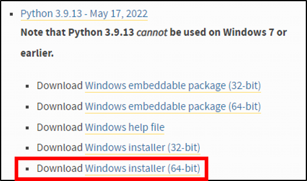
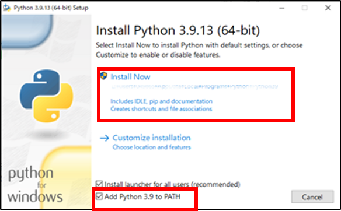
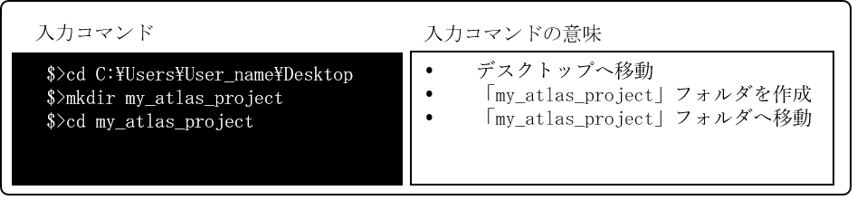
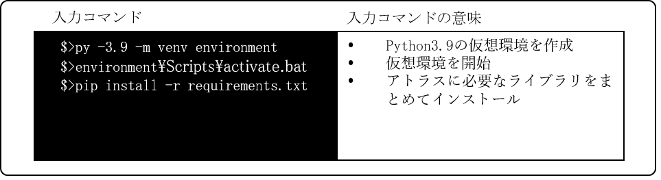

# 環境構築手順書

# 1 本書について

本書では、建物テクスチャアトラス化ツール（以下「本ツール」という。）の環境構築手順について記載しています。

# 2 環境構築

本ツールは、Windows環境での使用を想定しています。そのため、Windowsで動作する環境構築を説明します。

## 2-1 ベース環境の構築

再アトラス化ツールは、Python言語で記述しています。よって、ツールの環境構築前にベースとなる環境を構築します。手順を以下に示します。

### 2-1-1 公式サイトへアクセス

以下の公式サイトをブラウザで開きます。

[https://www.python.org/downloads/windows/](https://www.python.org/downloads/windows/)

### 2-1-2 インストーラーのダウンロード

「Python 3.9.x」という表示の下にある「Windows installer (64-bit)」をクリックすると、Pythonインストーラーのダウンロードが始まります。本ツールでは、Python3.9.13を使用します

### 2-1-3 インストーラーの実行

ダウンロードが完了後、インストーラーをダブルクリックで開きます。「Add-Python3.9 to Path」にチェックを入れ、「Install Now」をクリックします。

### 2-1-4 管理者権限の付与

インストールには管理者権限が必要なため、ユーザアカウント制御確認ダイアログが表示される場合があります。表示された場合は、「はい」をクリックします。

### 2-1-5 インストールの完了

以下画面が表示されると、環境構築は完了です。

次に、再アトラス化ツールに必要なライブラリをインストールします。

## 2-2 Windows PowerShellの起動

Windowsの検索ボックスで「Windows PowerShell」と入力を行い、ターミナルを開きます。ここでは、Windows PowerShellを使った方法を記載しますが、コマンドプロンプト等でも同様にして実行可能です。

### 2-2-1 実行環境場所の作成

ターミナル上で、実行環境のフォルダを作成します。

### 2-2-2 ライブラリ一括インストールファイルのコピー

「my_atlas_project」フォルダへ「requirements.txt」をコピーします。

### 2-2-3 ライブラリのインストール

Python3.9の仮想環境を作成して、システムに必要なライブラリをインストールします。

### 2-2-4 構築完了

「my_atlas_project」フォルダへ、アトラス化のソースコード一式(Atlas_Prot)と入力データをコピーして、実行環境の構築は完了です。

### 2-2-5 実行時間の目安

表に示すデータおよびPCを使用した場合の実行時間は約25分です。

| 項目 | 名称 | 内容 |
| ---- | --- | ---- |
| 検証データ | 渋谷区データ | CityGML4ファイル、画像容量：500MB |
| PCスペック | プロセッサ | Intel Xeon W-2123 CPU@3.60GHz 3.60GHz |
|  | 実装RAM | 16.0GB |
|  | OS | Windows10 Pro（21H2） |
