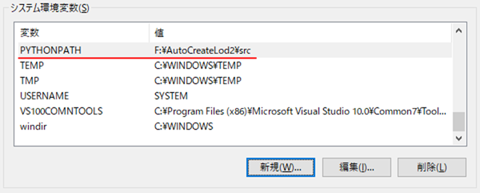
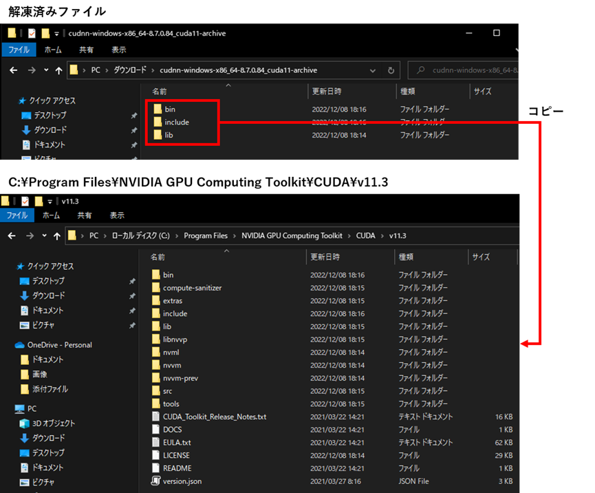
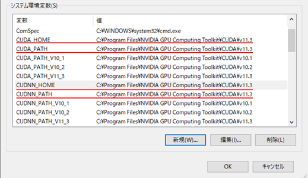
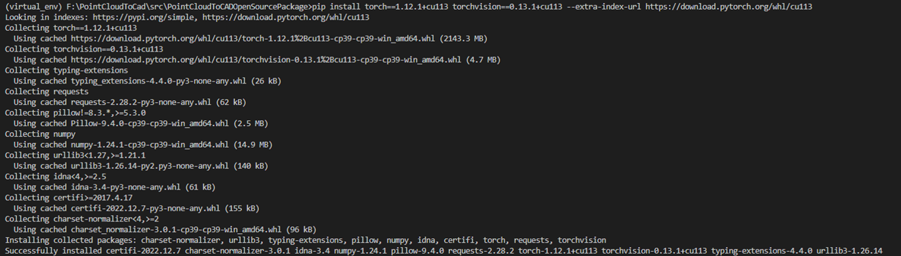
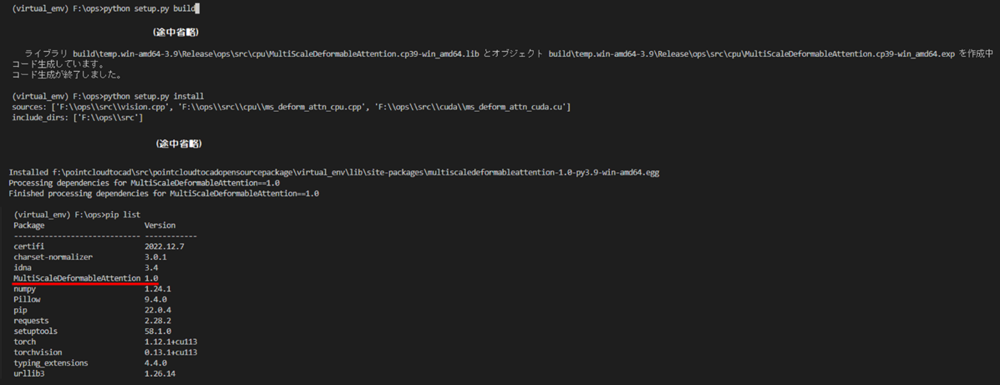

# 環境構築手順書

# 1 本書について

本書は、LOD2建築物モデル自動作成ツール(以下、「本ツール」という。)の環境構築手順について記載しています。

# 2 動作環境

本ツールの動作環境は以下のとおりです。

| 項目               | 最小動作環境        | 推奨動作環境               |
| ------------------ | ------------------ | ------------------------- |
| OS                 | Microsoft Windows 10 または 11 | 同左 |
| CPU                | Intel Core i5以上 | Intel Core i7以上 |
| Memory             | 8GB | 16GB以上 |
| GPU                | NVIDIA Quadro P620以上 | NVIDIA RTX 2080以上|
| GPU Memory         | 2GB | 8GB以上 |

# 3 ソフトウェア環境

| ライブラリ名 | ライセンス | 説明 |
| ----------- | --------- | ---- |
|alphashape|MIT License|点群外形形状作成ライブラリ|
|anytree|Apache 2.0|木構造ライブラリ|
|autopep8|MIT License|コーディング規約(PEP)準拠にソースコードを自動修正するフォーマッターライブラリ|
|coverage|Apache 2.0|カバレッジ取得ライブラリ|
|einops|MIT License|数値計算ライブラリ|
|flake8|MIT License|静的解析ライブラリ|
|jakteristics|BSD License|点群の幾何学的特徴量計算ライブラリ|
|laspy|BSD 2-Clause License|LASファイル処理ライブラリ|
|lxml|BSD 3-Clause License|xml処理ライブラリ|
|matplotlib|Python Software Foundation License|グラフ描画ライブラリ|
|MLCollections|Apache 2.0|機械学習ライブラリ|
|MultiScaleDeformableAttention|Apache 2.0|物体検出ライブラリ|
|NumPy|BSD 3-Clause License|数値計算ライブラリ|
|Open3D|MIT License|点群処理ライブラリ|
|opencv-python|MIT License|画像処理ライブラリ|
|opencv-contrib-python|MIT License|画像処理ライブラリ|
|Pytorch|BSD 3-Clause License|機械学習ライブラリ|
|plateaupy|MIT License|CityGML読み込みライブラリ|
|PyMaxflow|GNU General Public License version 3.0|GraphCut処理ライブラリ|
|pyproj|MIT License|地理座標系変換ライブラリ|
|PuLP|BSD License|数理最適化ライブラリ|
|scikit-learn|BSD 3-Clause License|機械学習ライブラリ|
|scipy|BSD 3-Clause License|統計や線形代数、信号・画像処理などのライブラリ|
|Shapely|BSD 3-Clause License|図形処理ライブラリ|
|Torchvision|BSD 3-Clause Lisence|機械学習ライブラリ|

# 4 環境構築

## 4-1 リポジトリのクローン

以下のコマンドでリポジトリをクローンします。

```
> git clone https://github.com/Project-PLATEAU/Auto-Create-bldg-lod2-tool.git
```

## 4-2 AIモデルパラメータのダウンロード

本ツールに搭載されているAIモデルのパラメータを以下よりダウンロードします。

| 項目 | ファイル |
| - | - |
| 建物分類用モデル | [classifier_parameter.pkl](https://drive.google.com/file/d/1hs-DT4Y0ZtjdV9kJ438lvAPpJcfz_dE_/view?usp=drive_link) |
| 屋根線検出用モデル | [roof_edge_detection_parameter.pth](https://drive.google.com/file/d/1QqxfS05a4T1_IdrzYle3iuBXjuyqFz-u/view?usp=drive_link) |
| バルコニー検出用モデル | [balcony_segmentation_parameter.pkl](https://drive.google.com/file/d/1MINHffIvcooDOrQq3E4mBvdsgWUfzIi5/view?usp=drive_link) |

ダウンロードしたファイル（classifier_parameter.pkl、roof_edge_detection_parameter.pth、balcony_segmentation_parameter.pkl）をAutoCreateLod2/src/createmodel/data/フォルダに保存します。\
(AutoCreateLod2/srcは本ツールのsrcフォルダまでのパス)

# 5 仮想環境の作成

専用環境を作成しツールを実行する場合、仮想環境を構築することを推奨します。\
例として以下にvenvを使用した仮想環境の作成手順を示します。\
venv は Python の標準ツールであるため、インストールは不要です。なお、コマンドプロンプト上での操作とします。

## 5-1 作成

以下のコマンドを使用し、仮想環境を作成します。一度実施すれば良いです。

```
> cd [仮想環境を作成するフォルダパス]
> py -[Pythonのインストールバージョン] -m venv [仮想環境名]
```

[Pythonのインストールバージョン]：例として「3.9」など\
[仮想環境名]：任意の名称

## 5-2 切り替え

以下のコマンドを使用し、作成した環境へ切り替えを行います。

```
> cd [仮想環境を作成したフォルダパス]
> [仮想環境名]\Scripts\activate.bat
```

[仮想環境名]：作成した仮想環境名

## 5-3 終了

仮想環境を終了する場合には以下のコマンドを使用し、切り替えた環境を終了します。\
このまま環境構築を実施する場合には終了する必要はありません。

```
> deactivate
```

# 6 システム環境の構築

本ツールを実行するための環境構築として、システム環境変数の登録と仮想環境へ依存ライブラリのインストールを行います。\
なお、依存ライブラリのインストールで使用するrequirements.txtはツールのフォルダ内に同梱しています。

## 6-1 システム環境変数の登録

| 変数名          | 値 |
| -------------- | -------- |
| PYTHONPATH     | F:\AutoCreateLod2\src (本ツールのsrcフォルダまでのパス) |

<システム環境構築におけるシステム環境変数の登録>



## 6-2 依存ライブラリのインストール

以下コマンドを使用して、仮想環境に依存ライブラリをインストールします。\
requirements.txtは、本ツールのソースコードに同梱しています。

```
> pip install –r requirements.txt
```

# 7 GPU環境の構築

GPU環境の構築方法を以下に示します。なお、手順7-1～7-4はPCに対して一度設定すれば良いです。\
手順7-5以降に関しては、仮想環境ごとに設定する必要があります。

[GPU環境構築時の注意点]

仮想環境に、torch、 torchvisionライブラリ、拡張モジュールをインストールする作業は、システム環境の構築後に行う必要があります。

## 7-1 Build Tools for Visual Studioのインストール

以下より、Build Tools for Visual Studio 2017、または、Build Tools for Visual Studio 2019をダウンロードし、インストールします。\
なお、Visual Studio 2017 、または、Visual Studio 2019のインストールでも良いです。

[https://visualstudio.microsoft.com/ja/downloads/](https://visualstudio.microsoft.com/ja/downloads/)

## 7-2 cuda toolkit 11.3のインストール

以下より、cuda toolkit 11.3 をダウンロードし、インストールします。\
なお、インストールオプションはデフォルト値のままで良いです。

[https://developer.nvidia.com/cuda-11.3.0-download-archive?target_os=Windows&target_arch=x86_64&target_version=10&target_type=exe_local](https://developer.nvidia.com/cuda-11.3.0-download-archive?target_os=Windows&target_arch=x86_64&target_version=10&target_type=exe_local)

## 7-3 cuDNNのインストール

以下よりcuDNNをダウンロードします。

[https://developer.nvidia.com/rdp/cudnn-download](https://developer.nvidia.com/rdp/cudnn-download)

ダウンロードした「cudnn-windows-x86_64-8.6.0.163_cuda11-archive.zip」を解凍します。\
解凍したファイルを「C:\Program Files\NVIDIA GPU Computing Toolkit\CUDA\v11.3」以下の該当フォルダにコピーします。

<cuDNNのインストール>


## 7-4 システム環境変数の追加

システム環境変数に、以下の4変数を登録します。4変数の値は、共通とします。

| 変数名          | 値 |
| -------------- | -------- |
| CUDA_HOME, CUDA_PATH, CUDNN_HOME, CUDNN_PATH     | C:\Program Files\NVIDIA GPU Computing Toolkit\CUDA\v11.3 |

<GPU環境構築におけるシステム環境変数の登録>



## 7-5 torch, torchvisionのインストール

仮想環境に、torch, torchvisionをインストールします。

```
> pip install torch==1.12.1+cu113 torchvision==0.13.1+cu113 --extra-index-url https://download.pytorch.org/whl/cu113
```

<torch, torchvisionのインストール>

 

## 7-6 拡張モジュールのインストール

「src\createmodel\housemodeling\roof_edge_detection_model\thirdparty\heat\models\ops」フォルダをコピーし、任意のフォルダに貼り付けます。(opsフォルダのパスを短くすることが目的です。) \
仮想環境にて、拡張モジュールのビルドとインストールを行います。

```
> cd F:\ops
> python setup.py build
> python setup.py install
```

<拡張モジュールのインストール >

  

インストール後、pip listコマンドにて「MultiScaleDeformableAttention」が一覧に表示されていれば、拡張モジュールのインストールが完了している状態です。
