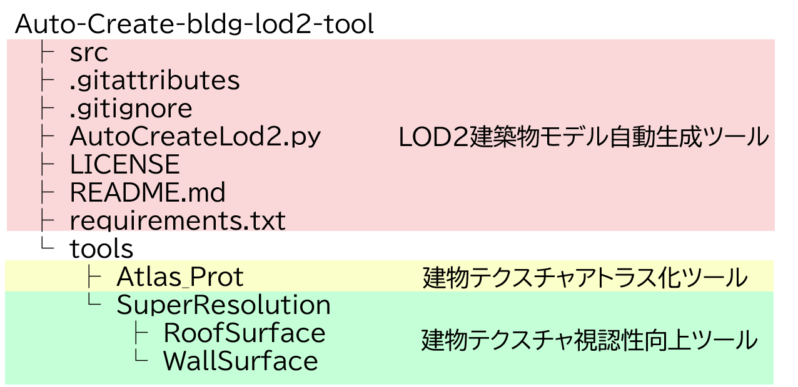
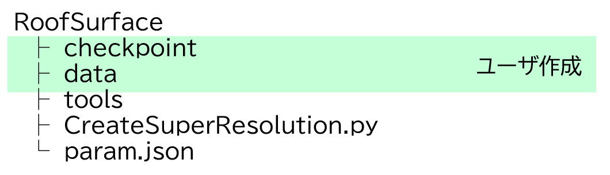
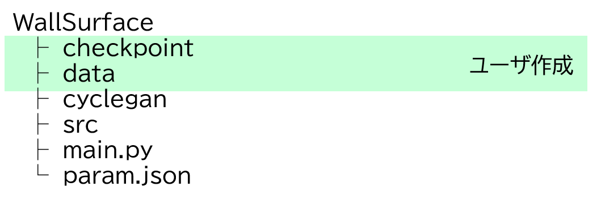
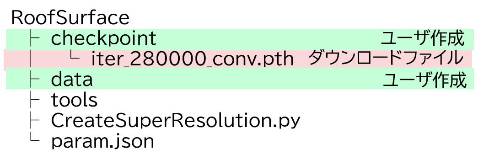
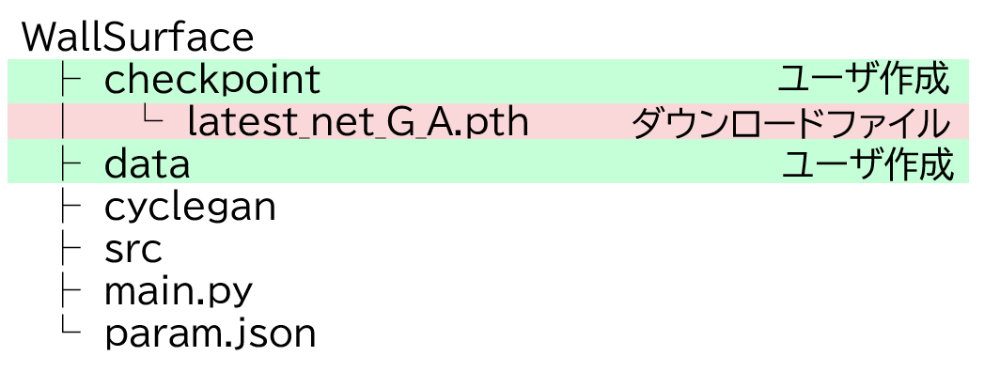

# 環境構築手順書

# 1 本書について

本書では、建物テクスチャ視認性向上ツール(以下「本ツール」という。)の環境構築手順について記載しています。

# 2 動作環境

本ツールの動作環境は以下のとおりです。

| 項目               | 推奨動作環境               |
| ------------------ | ------------------------- |
| OS                 | Microsoft Windows 10 または 11 |
| CPU                | Intel Core i7-11700F以上 |
| Memory             | 16GB以上 |
| GPU                | NVIDIA Quadro RTX 5000以上|
| GPU Memory         | 16GB以上 |

## 3 ソフトウェア環境

本ツールの使用言語は、Python（バージョン3.9）です。使用ライブラリを以下に示します。

 <ライブラリ一覧>

| ライブラリ名   | バージョン  | ライセンス                                   | 使用用途                  |
| ------------- | ---------- | ------------------------------------------- | ------------------------- |
| tqdm          | 4.63.0     | MIT License, Mozilla Public License 2.0     | プログレスバーの表示      |
| numpy         | 1.21.5     | BSD License (BSD-3-Clause)                  | 数値計算                  |
| Pillow        | 9.0.1      | Historical Permission Notice and Disclaimer | 画像の読み書き            |
| PyYAML        | 6.0        | MIT License                                 | yamlファイルの読み書き    |
| torch         | 1.12.1     | BSD License (BSD-3-Clause)                  | 機械学習                  |
| torchvision   | 0.13.1     | BSD                                         | 機械学習                  |
| lightning     | 1.9.5      | Apache Software License (Apache-2.0)        | 機械学習                  |
| opencv-python | 4.5.4.60   | Apache Software License (Apache-2.0)        | 画像の読み書き、画像処理  |
| networkx      | 2.6.3      | BSD License                                 | グラフ構造の管理          |
| openmim       | 0.3.6      | Apache 2.0 license                          | OpenMMLabライブラリの管理 |
| mmcv          | 2.0.0rc4   | Apache Software License                     | 機械学習                  |
| mmedit        | 1.0.0rc5   | Apache Software License (Apache-2.0)        | 機械学習                  |
| mmengine      | 0.10.1     | Apache Software License (Apache-2.0)        | 機械学習                  |

# 4 環境構築

## 4-1 ツール構成

本ツールは、下図に示す通りLOD2建築物モデル自動作成ツールのリポジトリ内に存在します。
また、本ツールは、屋根面視認性向上ツールと壁面視認性向上ツールで構成されています。

<a id="main_repo"></a>
<リポジトリ構成>



<屋根面視認性向上ツール構成>



<壁面視認性向上ツール構成>


## 4-2 リポジトリのクローン

以下のコマンドでリポジトリをクローンします。 \
リポジトリの構成は[こちら](#main_repo)を参照してください。

```
> git clone https://github.com/Project-PLATEAU/Auto-Create-bldg-lod2-tool.git
```

## 4-3 AIモデルパラメータのダウンロード

本ツールに搭載されているAIモデルのパラメータをダウンロードします。

### 4-3-1 屋根面視認性向上用モデル

屋根面視認性向上用モデル（ファイル名：iter_280000_conv.pth）をダウンロードします。

<https://drive.google.com/file/d/1xBFAVgGeIGFsvMN6bG_Y9renLyNm46is/view?usp=drivesdk>

ダウンロードしたファイルは下図の位置に保存します。



### 4-3-2 壁面視認性向上用モデル

壁面視認性向上用モデル（ファイル名：latest_net_G_A.pth）をダウンロードします。

<https://drive.google.com/file/d/14tsr1r1s6aI6fm-cX7ZfcGr-56SdiTid/view?usp=drivesdk>

ダウンロードしたファイルは下図の位置に保存します。



# 5 仮想環境の作成

専用環境を作成しツールを実行する場合、仮想環境を構築することを推奨します。\
例として以下にvenvを使用した仮想環境の作成手順を示します。\
venv は Python の標準ツールであるため、インストールは不要です。なお、コマンドプロンプト上での操作とします。

## 5-1 作成

以下のコマンドを使用し、仮想環境を作成します。一度実施すれば良いです。

```
> cd [仮想環境を作成するフォルダパス]
> py -[Pythonのインストールバージョン] -m venv [仮想環境名]
```

[Pythonのインストールバージョン]：例として「3.9」など\
[仮想環境名]：任意の名称

## 5-2 切り替え

以下のコマンドを使用し、作成した環境へ切り替えを行います。

```
> cd [仮想環境を作成したフォルダパス]
> [仮想環境名]\Scripts\activate.bat
```

[仮想環境名]：作成した仮想環境名

## 5-3 終了

仮想環境を終了する場合には以下のコマンドを使用し、切り替えた環境を終了します。\
このまま環境構築を実施する場合には終了する必要はありません。

```
> deactivate
```

# 6 依存ライブラリのインストール

以下コマンドを使用して、仮想環境に依存ライブラリをインストールします。\
requirements.txtは、本ツールのソースコードに同梱しています。

```
> pip install –r requirements.txt
```

# 7 GPU環境の構築

GPU環境の構築方法を以下に示します。なお、手順7-1～7-4はPCに対して一度設定すれば良いです。\
手順7-5以降に関しては、仮想環境ごとに設定する必要があります。

[GPU環境構築時の注意点]

仮想環境に、torch、 torchvisionライブラリ、拡張モジュールをインストールする作業は、システム環境の構築後に行う必要があります。

## 7-1 Build Tools for Visual Studioのインストール

以下より、Build Tools for Visual Studio 2017、または、Build Tools for Visual Studio 2019をダウンロードし、インストールします。\
なお、Visual Studio 2017 、または、Visual Studio 2019のインストールでも良いです。

[https://visualstudio.microsoft.com/ja/downloads/](https://visualstudio.microsoft.com/ja/downloads/)

## 7-2 cuda toolkit 11.3のインストール

以下より、cuda toolkit 11.3 をダウンロードし、インストールします。\
なお、インストールオプションはデフォルト値のままで良いです。

[https://developer.nvidia.com/cuda-11.3.0-download-archive?target_os=Windows&target_arch=x86_64&target_version=10&target_type=exe_local](https://developer.nvidia.com/cuda-11.3.0-download-archive?target_os=Windows&target_arch=x86_64&target_version=10&target_type=exe_local)

## 7-3 cuDNNのインストール

以下よりcuDNNをダウンロードします。

[https://developer.nvidia.com/rdp/cudnn-download](https://developer.nvidia.com/rdp/cudnn-download)

ダウンロードした「cudnn-windows-x86_64-8.6.0.163_cuda11-archive.zip」を解凍します。\
解凍したファイルを「C:\Program Files\NVIDIA GPU Computing Toolkit\CUDA\v11.3」以下の該当フォルダにコピーします。

<cuDNNのインストール>

 <!-- 画像はLOD2建物ツールを流用 -->

## 7-4 システム環境変数の追加

システム環境変数に、以下の4変数を登録します。4変数の値は、共通とします。

| 変数名          | 値 |
| -------------- | -------- |
| CUDA_HOME, CUDA_PATH, CUDNN_HOME, CUDNN_PATH     | C:\Program Files\NVIDIA GPU Computing Toolkit\CUDA\v11.3 |

<GPU環境構築におけるシステム環境変数の登録>

 <!-- 画像はLOD2建物ツールを流用 -->

## 7-5 torch, torchvisionのインストール

仮想環境に、torch, torchvisionをインストールします。

```
> pip install torch==1.12.1+cu113 torchvision==0.13.1+cu113 --extra-index-url https://download.pytorch.org/whl/cu113
```

<torch, torchvisionのインストール>

  <!-- 画像はLOD2建物ツールを流用 -->

## 7-6 拡張モジュールのインストール

「src\createmodel\housemodeling\roof_edge_detection_model\thirdparty\heat\models\ops」フォルダをコピーし、任意のフォルダに貼り付けます。(opsフォルダのパスを短くすることが目的です。) \
仮想環境にて、拡張モジュールのビルドとインストールを行います。

```
> cd F:\ops
> python setup.py build
> python setup.py install
```

<拡張モジュールのインストール >

   <!-- 画像はLOD2建物ツールを流用 -->

インストール後、pip listコマンドにて「MultiScaleDeformableAttention」が一覧に表示されていれば、拡張モジュールのインストールが完了している状態です。
