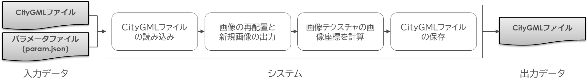
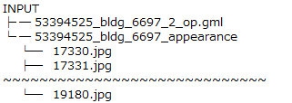
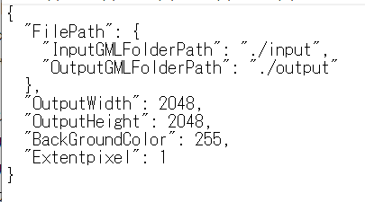
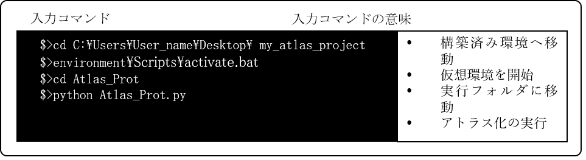
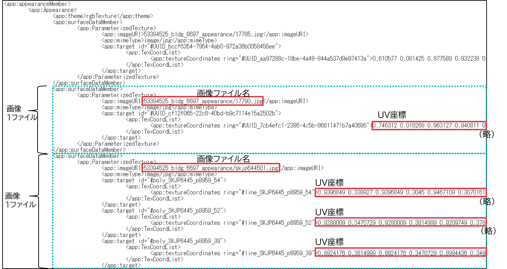

# 操作マニュアル

# 1 本書について

本書では、建物テクスチャアトラス化ツール（以下「本ツール」という。）の操作手順について記載しています。

# 2 アトラス化ツールについて

本ツールは、PLATEAUが採用する都市スケールのデータセット単位（CityGML2.0）におけるAppearanceクラスのアトラス化処理を行うツールです。Appearanceクラスには、テクスチャ画像ファイル名や座標情報等、テクスチャに関する属性が記述されています。\
建物テクスチャは、建物1棟に対して1つの画像ファイルを貼付する手法が主流となっていますが、1棟1画像ファイルとすると、画像ファイル数が多くなり、描画時の画像参照（読込）に時間を要することが課題です。\
そこで、1棟1画像ファイルのCityGML2.0から、複数棟1画像ファイルへ統合するアトラス化ツールを開発しました。本ドキュメントはアトラス化ツールの利用に関するマニュアルです。

# 3 機能概要

本ツールは、令和4年度に整備されたCityGML2.0と紐づく、テクスチャ画像ファイル（1ファイルに対し建物1棟）のデータを対象とします。テクスチャ画像の形式はJPG/PNGです。

<再アトラス化ツールの処理フロー>

1. CityGML読込\
建物LOD2のCityGMLを読み込みます。建物内でポリゴン高さ順にソートし、建物座標からまとめる範囲を計算します。
2. 画像再配置\
入力した画像を一定の範囲ごとに集約し、再配置した画像を作成します。再配置では画像の回転等は行わず、そのまま配置します。範囲は5次メッシュ相当を一定で分割した範囲の建物を2048以下の画像にアトラス化します。大型の建物では1棟で規定の画像サイズを超える場合もあり、その場合はアトラス化対象から自動除外します。
3. 画像テクスチャ座標計算\
アトラス化した画像におけるUV座標を算出します。
4. CityGML出力\
画像座標(UV)と参照画像URIを更新します。

# 4 入力ファイル

本ツールは、CityGML2.0に記載されている画像ファイル名とポリゴン名を、再編した後のデータに差し替える処理を行います。入力するデータ一覧を、以下に示します。

<再アトラス化ツールの入力データ>

| 入力データ | 内容 |
| --------- | ----- |
| CityGML2.0 | GML形式及び、Appearanceの画像一式 |
| パラメータファイル | 再アトラス化を処理するためのパラメータ情報ファイル（JSON形式） |

- CityGML2.0\
入力に使用するCityGML2.0のフォルダ構造例を下図に示します。なお、再アトラス化ツールの出力フォルダ構成は、入力するCityGML2.0のファイル構成と同じであり、CityGMLファイル及びappearance画像一式のフォルダを出力します。\
CityGMLで指定する画像のポリゴン座標はUV座標に変換した際に0～1になることとします。(負数は非対応とします。)

<再アトラス化ツールの入力サンプル（CityGML2.0フォルダ構成）>

- パラメータファイル（param.json）\
パラメータを記載したparam.jsonファイルは、使用環境に合わせて編集することができます。パラメータファイルには、入出力フォルダの相対パスおよび、内部で使用する各種パラメータを記載する必要があります。

<再アトラス化ツールの可変内部パラメータファイルサンプル>

- 入力フォルダパス(InputGMLFolderPath)\
   CityGML2.0フォルダ構成の「INPUT」を示します。「INPUT」フォルダには、CityGMLファイルを格納してあるものとします。

- 出力フォルダパス（OutputGMLFolderPath）\
   アトラス化したCityGMLファイルを保存するフォルダを設定します。パスを記載すると自動的に作成されます。\
   実行する度にフォルダを作成するため、2度実行する場合は初めに保存したファイルは削除されます。

- 作成画像ファイルの幅（OutputWidth）\
   出力する画像ファイルの幅（単位：ピクセル）を設定します。\
   2の累乗の数値を指定します。

- 作成画像ファイルの高さ（OutputHeight）\
   出力する画像ファイルの高さ（単位：ピクセル）を設定します。\
   2の累乗の数値を指定します。

- 作成画像の背景色（BackGroundColor）\
   出力する画像の背景色を設定します。\
   0(黒)～255(白) の数値を指定します。

- ポリゴン余白（Extentpixel）\
   元画像から画像を切り出す際、外側を余分に切り取る場合幅（単位：ピクセル）を設定します。\
   描画時にポリゴン境目がスムーズになるように、元画像を大きめに切り出す際に使用します。不要な場合は0を指定します。

# 5 アトラス化の実行

## 5-1 ツールの実行

コマンドライン実行で、再アトラス化を行います。コマンドライン実行に使用するアプリは、Windows PowerShellまたはコマンドプロンプト等のターミナルの使用を想定します。\
構築した環境へアクセスして、コマンドラインで実行します。処理が完了すると、可変内部パラメータファイル(.json)に記載した出力フォルダへ、再アトラス化されたCityGML2.0が保存されます。

<アトラス化後のCityGMLファイル例>

## 5-2 実行時間の目安

表に示すデータおよびPCを使用した場合の実行時間は約25分です。

| 項目 | 名称 | 内容 |
| ---- | --- | ---- |
| 検証データ | 渋谷区データ | CityGML4ファイル、画像容量：500MB |
| PCスペック | プロセッサ | Intel Xeon W-2123 CPU@3.60GHz 3.60GHz |
|  | 実装RAM | 16.0GB |
|  | OS | Windows10 Pro（21H2） |
