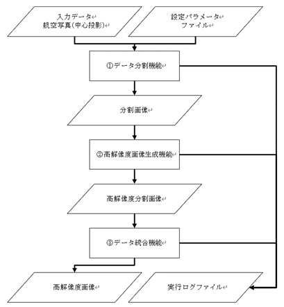
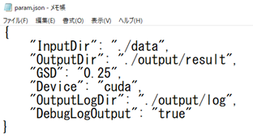
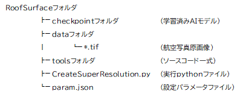
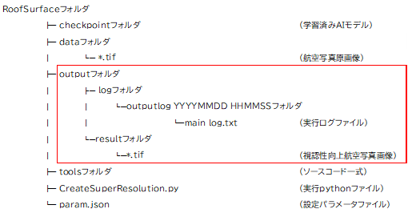
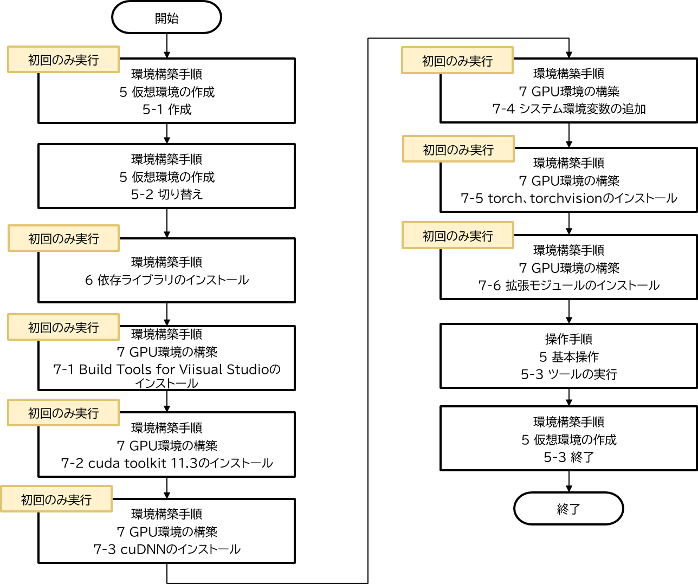

# 操作マニュアル

# 1 本書について

本書では、建物テクスチャ視認性向上ツールの内の屋根面視認性向上ツール（以下、屋根面ツールという。）の操作手順について記載しています。

# 2 屋根面視認性向上ツールについて

LOD2建築物（以下、LOD2建物）に貼付されているテクスチャ画像は、一般的には航空写真をもとに作られており、地上解像度等の撮影条件の影響を受け、視認性が低いケースがあります。そこでLOD2建物の視認性を向上するツールを開発しました。このツールは、屋根面視認性向上ツールと壁面視認性向上ツールで構成されています。屋根面ツールは、LOD2建築物モデル自動生成ツール <https://github.com/Project-PLATEAU/Auto-Create-bldg-lod2-tool> への入力データである航空写真（中心投影）を入力とし、地上画素寸法6.25cm相当に超解像化された画像を出力します。

<屋根面ツールの処理フロー>



1. データ分割機能 \
航空写真を読み込み、本システムが動作可能な画像サイズに変更します。

2. 高解像度画像生成機能 \
機械学習モデルを使用して、分割した画像ファイルの高解像度化を行います。

3. データ統合機能 \
高解像度化した分割画像ファイルを統合して、1枚の高解像度の画像ファイルを作成します。

# 3 システム入力

## 3-1 入力ファイル一覧

以下に屋根面ツールの入力ファイルを記載します。

<入力ファイル一覧>

| No | データ名 | ファイルフォーマット | 説明 |
| - | - | - | - |
| 1 | 航空写真（中心投影） | TIFF | ・ 直下視の航空写真（中心投影）<br>・ 24ビットフルカラー形<br>・ 地上画素寸法：10～25cm |
| 2 | 設定パラメータ | JSON | ・ 実行時に使用するパラメータファイル |

## 3-2 設定パラメータファイル

設定パラメータファイルには、入出力フォルダの相対パスおよび、内部で使用する各種パラメータを記載します。

<設定パラメータファイルの仕様>

| ファイル形式 | ファイル名 | 格納フォルダ | 特記事項 |
| - | - | - | - |
| JSON | param.json | 任意 | 文字コードはUTF-8とします。 |

設定パラメータファイルのパラメータ一覧を以下に記載します。

<設定パラメータ一覧>

| No | キー名 | 値形式 | 説明 |
| - | - | - | - |
| 1 | InputDir | 文字列| 航空写真が保存されているフォルダパス |
| 2 | OutputDir| 文字列| 途中結果と最終結果を出力するフォルダパス |
| 3 | GSD| 数値| 航空写真の地上画素寸法。単位はメートル。|
| 4 |【任意】Device | 文字列| 推論を実行するデバイス。CPUのみの環境では[cpu]を指定する。デフォルトは[cuda] |
| 5 | OutputLogDir | 文字列| ログのフォルダパス。未記入又は存在しない場合は、本システムのPythonコードと同階層にログファイルを作成する。 |
| 6 |【任意】DebugLogOutput | 真偽値| デバッグレベルのログを出力するかどうかのフラグ。True又はfalseで値を指定する。<br>未記入又は真偽値以外の値が入力された場合は、falseとする。 |

<記載例>



<a id="input_folder_ex"></a>
<実行前フォルダ構成例>



# 4 システム出力

## 4-1 出力ファイル一覧

以下に屋根面ツールの出力ファイルを記載します。

<出力ファイル一覧>

| No | データ名 | ファイル形式 | 説明 |
| - | -  | - | - |
| 1 | 視認性向上航空写真画像 | TIFF        | 高解像度化された航空写真 |
| 2 | 実行ログ | TXT | 実行履歴が記録される |

<a id="output_folder_ex"></a>
<実行後フォルダ構成例>



## 4-2 視認性向上航空写真画像

地上画素寸法6.25cm相当に高解像度された航空写真が出力されます。 \
この画像はLOD2建築物モデル自動生成ツールの入力データとして利用することができます。 \
この際、内部標定パラメータファイルの1pixelのサイズを下記の式で算出し入力してください。

```
PixelSize_x_SuperResolution = PixelSize_x_Original × 6.25 / GSD
PixelSize_y_SuperResolution = PixelSize_y_Original × 6.25 / GSD
```

PixelSize_x_SuperResolution, PixelSize_y_SuperResolution：高解像度化された航空写真用のカメラセンサ1pixel(x,y)のサイズ(μm) \
PixelSize_x_Original, PixelSize_y_Original：カメラセンサ1pixel(x,y)の実サイズ(μm) \
GSD：屋根面ツールに入力した航空写真の地上画素寸法(m)

※内部標定パラメータファイルの詳細は、LOD2建築物モデル自動生成ツールの操作マニュアル 「3-4 内部標定パラメータファイル」をご覧ください。

## 4-3 実行ログ

実行記録が記載されたファイルです。出力内容は、指定パラメータ内容、処理開始時刻、処理終了時刻、処理時間等です。

# 5 基本操作

屋根面ツールの操作手順を記載します。

## 5-1 入力ファイルの準備

屋根面ツールに入力するデータの作成を行います。(入力データの詳細については、[3 システム入力](#3-システム入力)を参照してください。また、チュートリアル用のデータセットを[6 チュートリアルデータセット](#6-チュートリアルデータセット)に用意してあります。) \
入力データとして使用する航空写真（中心投影）は、[実行前フォルダ構成例](#input_folder_ex)のように、dataフォルダに格納してください。チュートリアルデータを利用する場合は、データセットのRawImageフォルダに格納されている航空写真（TIFFファイル）をdataフォルダに格納してください。

## 5-2 設定パラメータファイルの作成

入力ファイルの準備が完了したら、設定パラメータファイルの作成を行います。 \
設定パラメータファイルの記載内容については、[3-2 設定パラメータファイル](#3\-2-設定パラメータファイル)を参照してください。

## 5-3 ツールの実行

下図に操作手順を示します。

<操作手順>



屋根面ツールを実行するにあたり、仮想環境を用意する必要があります。 \
なお、仮想環境の構築は初回のみの作業です。仮想環境の構築手順の詳細は、環境構築手順書を参照してください。\
入力ファイルの準備、設定パラメータファイルの作成、および、仮想環境の構築が完了した場合は、仮想環境上で屋根面ツールを実行します。

屋根面ツールを実行する際のコマンドを以下に示します。(上図、操作手順のツールの実行で使用するコマンド)

```
python CreateSuperResolution.py param.json
```

CreateSuperResolution.py：屋根面ツールのPythonコード \
param.json：設定パラメータファイル

屋根面ツールの動作が終了した後は、仮想環境の終了動作を行うことで仮想環境から抜け出すことが出来ます。 \
出力ファイルの確認を行う際は、以下フォルダの確認を行います。（[実行後フォルダ構成例](#output_folder_ex)）

| 出力ファイル | 出力場所 |
| - | - |
| 視認性向上航空写真画像 | 設定パラメータファイルのOutputDirで指定したフォルダ |
| 実行ログ | 設定パラメータファイルのOutputLogDirで指定したフォルダ |

# 6 チュートリアルデータセット

## 6-1 データのダウンロード

チュートリアル用のデータセットを[こちら](https://drive.google.com/file/d/1UnxBL2MrDZaQ5EF44TXCFc-ZnVbp9Gf6/view?usp=drive_link)からダウンロード可能です。 \
データセットは、LOD2建築物モデル自動生成ツールの操作マニュアルで提供されているデータセットと同一です。
