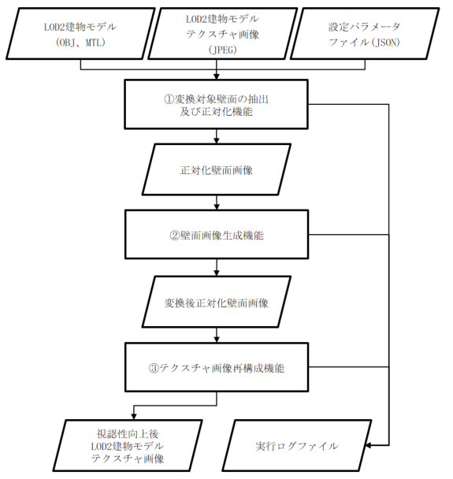
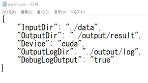
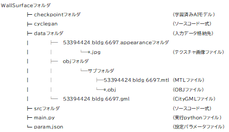
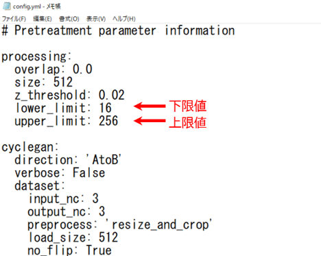
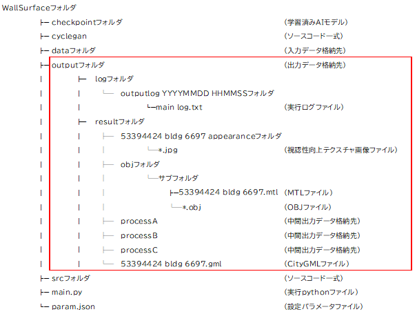

# 操作マニュアル

# 1 本書について

本書では、建物テクスチャ視認性向上ツールの内の壁面視認性向上ツール（以下、壁面ツールという。）の操作手順について記載しています。

# 2 壁面視認性向上ツールについて

LOD2建築物（以下、LOD2建物）に貼付されているテクスチャ画像は、一般的には航空写真をもとに作られており、地上解像度等の撮影条件の影響を受け、視認性が低いケースがあります。そこでLOD2建物の視認性を向上するツールを開発しました。このツールは、屋根面視認性向上ツールと壁面視認性向上ツールで構成されています。壁面ツールは、LOD2建築物モデル自動生成ツール <https://github.com/Project-PLATEAU/Auto-Create-bldg-lod2-tool> で出力されたテクスチャ画像を入力とし、壁面部のみ視認性を向上させた画像変換されたテクスチャ画像を出力します。

<壁面ツールの処理フロー>



1. 変換対象壁面の抽出及び正対化機能 \
LOD2建物モデル（OBJ、MTL）及びテクスチャ画像を読み込み、変換対象壁面テクスチャ画像のみ抽出し正対化します。

2. 壁面画像生成機能 \
機械学習モデルを使用して正対化壁面画像ファイルを壁面らしい画像に変換します。

3. テクスチャ画像再構成機能 \
壁面画像生成モジュールで生成された正対化壁面画像ファイルを変換対象壁面の抽出及び正対化モジュールで算出した射影変換式を用いて入力時のテクスチャ画像に再構成します。

# 3 システム入力

## 3-1 入力ファイル一覧

以下に壁面ツールの入力ファイルを記載します。

<入力ファイル一覧>

| No | データ名 | ファイルフォーマット | 説明 |
| - | - | - | - |
| 1 | LOD2建物モデル | OBJ, MTL, JPEG | ・ LOD2建築物モデル自動生成ツールで出力されたテクスチャ付きLOD2建物モデル（OBJファイル、MTLファイル、JPEGファイル） |
| 2 | 設定パラメータ | JSON　| ・ 実行時に使用するパラメータファイル |

## 3-1 LOD2建物モデル

LOD2建築物モデル自動生成ツールで出力されたテクスチャ付きLOD2建物モデルです。 \
LOD2建物モデル生成の際に、OBJファイルを出力してください。詳細は、LOD2建築物モデル自動生成ツールの操作マニュアル 「3-2 設定パラメータファイル」をご覧ください。

## 3-2 設定パラメータファイル

設定パラメータファイルには、入出力フォルダの相対パスおよび、内部で使用する各種パラメータを記載します。

<設定パラメータファイルの仕様>

| ファイル形式 | ファイル名 | 格納フォルダ | 特記事項 |
| - | - | - | - |
| JSON | param.json | 任意 | 文字コードはUTF-8とします。 |

設定パラメータファイルのパラメータ一覧を以下に記載します。

<設定パラメータ一覧>

| No | キー名 | 値形式 | 説明 |
| - | - | - | - |
| 1 | InputDir | 文字列  | LOD2建物モデルファイルのパス |
| 2 | OutputDir | 文字列  | 途中結果と最終結果を出力するフォルダパス　|
| 3 |【任意】Device | 文字列  | 推論を実行するデバイス。CPUのみの環境では[cpu]を指定する。デフォルトは[cuda] |
| 4 | OutputLogDir | 文字列  | ログのフォルダパス。未記入又は存在しない場合は、本システムのPythonコードと同階層にログファイルを作成する。 |
| 5 |【任意】DebugLogOutput | 真偽値  | デバッグレベルのログを出力するかどうかのフラグ。True又はfalseで値を指定する。<br>未記入又は真偽値以外の値が入力された場合は、falseとする。 |

<記載例>



<a id="input_folder_ex"></a>
<実行前フォルダ構成例>



なお、変換対象壁面の抽出及び正対化機能において、正対化画像のうち、縦横ともに下限値以上、上限値以下の画像のみを変換対象としています。デフォルトでは下限値：16px、上限値：256pxとしていますが、srcフォルダ下config.ymlファイル内「lower_limit」および「upper_limit」を更新することで変更可能です。

<config.yml変更例>




# 4 システム出力

## 4-1 出力ファイル一覧

以下に壁面ツールの出力ファイルを記載します。

<出力ファイル一覧>

| No | データ名 | ファイル形式 | 説明 |
| - | -  | - | - |
| 1 | 壁面視認性向上LOD2建物モデル | OBJ, MTL, JPEG | 壁面が視認性向上されたLOD2建物モデル |
| 2 | 実行ログ | TXT | 実行履歴が記録される |

<a id="output_folder_ex"></a>
<実行後フォルダ構成例>



## 4-2 壁面視認性向上LOD2建物モデル

壁面が視認性向上されたLOD2建物モデルが出力されます。

## 4-3 実行ログ

実行記録が記載されたファイルです。出力内容は、指定パラメータ内容、処理開始時刻、処理終了時刻、処理時間等です。

# 5 基本操作

壁面ツールの操作手順を記載します。

## 5-1 入力ファイルの準備

壁面ツールに入力するデータの作成を行います。(入力データの詳細については、[3 システム入力](#3-システム入力)を参照してください。また、チュートリアル用のデータセットを[6 チュートリアルデータセット](#6-チュートリアルデータセット)に用意してあります。) \
入力データとして使用するLOD2建物モデルは、[実行前フォルダ構成例](#input_folder_ex)のように、dataフォルダに格納してください。

## 5-2 設定パラメータファイルの作成

入力ファイルの準備が完了したら、設定パラメータファイルの作成を行います。 \
設定パラメータファイルの記載内容については、[3-2 設定パラメータファイル](#3\-2-設定パラメータファイル)を参照してください。

## 5-3 ツールの実行

下図に操作手順を示します。

<操作手順>

 <!-- 画像は屋根面ツールを流用 -->

壁面ツールを実行するにあたり、仮想環境を用意する必要があります。 \
なお、仮想環境の構築は初回のみの作業です。仮想環境の構築手順の詳細は、環境構築手順書を参照してください。\
入力ファイルの準備、設定パラメータファイルの作成、および、仮想環境の構築が完了した場合は、仮想環境上で壁面ツールを実行します。

壁面ツールを実行する際のコマンドを以下に示します。(上図、操作手順のツールの実行で使用するコマンド)

```
python main.py param.json
```

main.py：壁面ツールのPythonコード \
param.json：設定パラメータファイル

壁面ツールの動作が終了した後は、仮想環境の終了動作を行うことで仮想環境から抜け出すことが出来ます。 \
出力ファイルの確認を行う際は、以下フォルダの確認を行います。（[実行後フォルダ構成例](#output_folder_ex)）

| 出力ファイル | 出力場所 |
| - | - |
| 壁面視認性向上LOD2建物モデル | 設定パラメータファイルのOutputDirで指定したフォルダ |
| 実行ログ | 設定パラメータファイルのOutputLogDirで指定したフォルダ |

# 6 チュートリアルデータセット

## 6-1 データのダウンロード

チュートリアル用のデータセットを[こちら](https://drive.google.com/file/d/12mTRVv3RS13ts_LzmI_288BizK6YD8bD/view?usp=drivesdk)からダウンロード可能です。 \
データセットは、LOD2建築物モデル自動生成ツールで生成されたテクスチャ付きLOD2建物モデルです。
